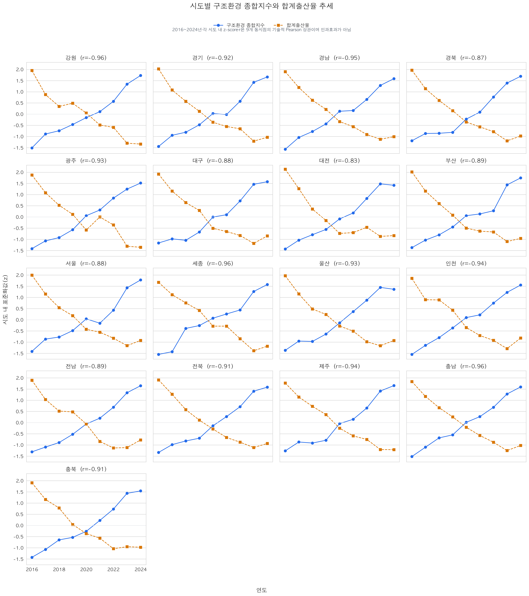
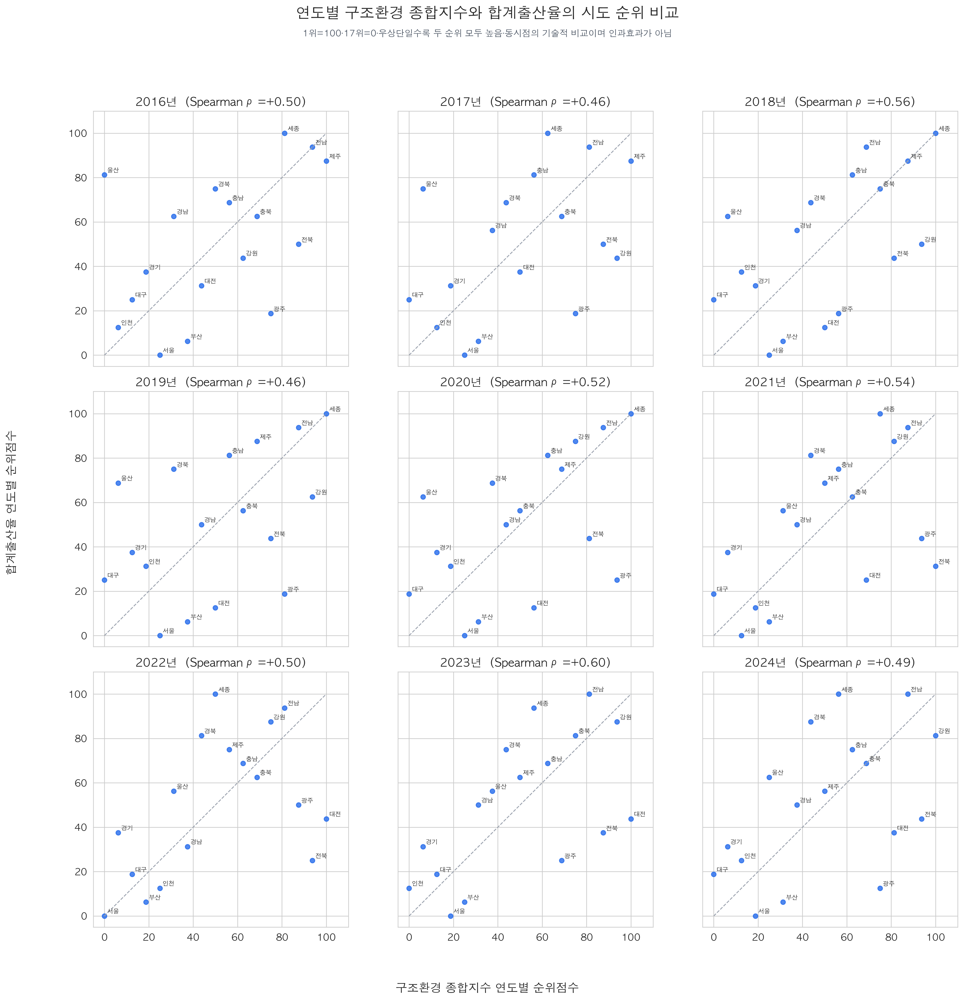
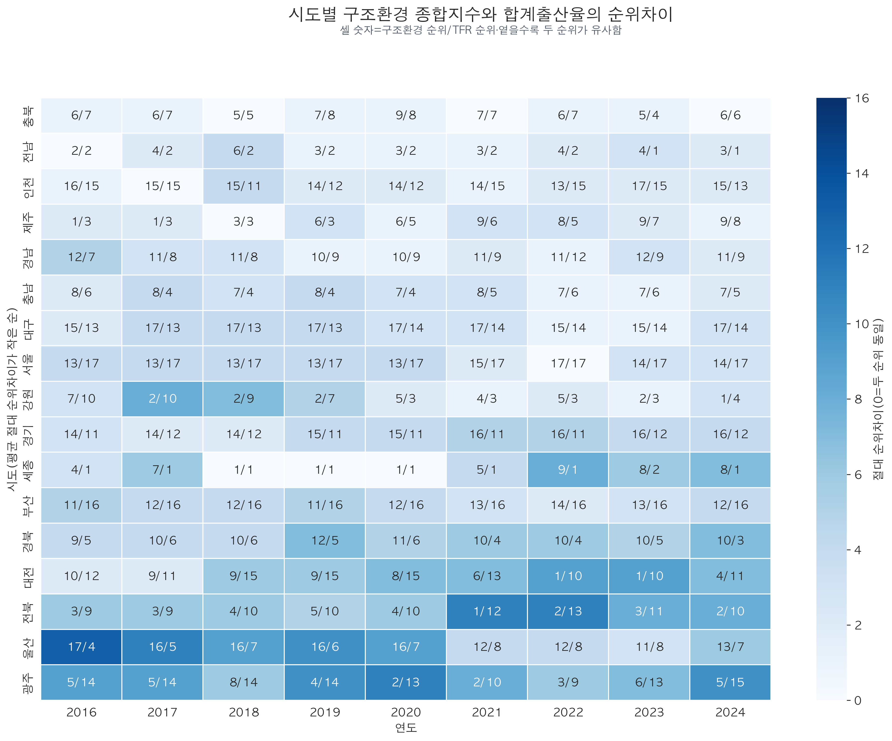
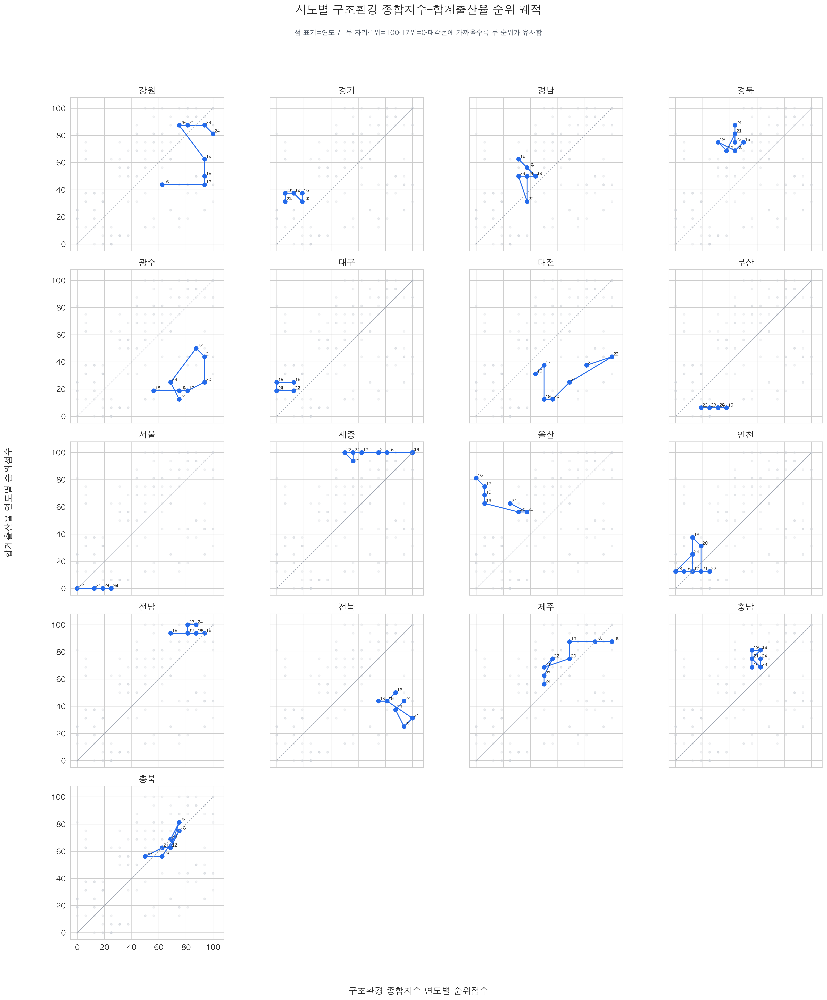
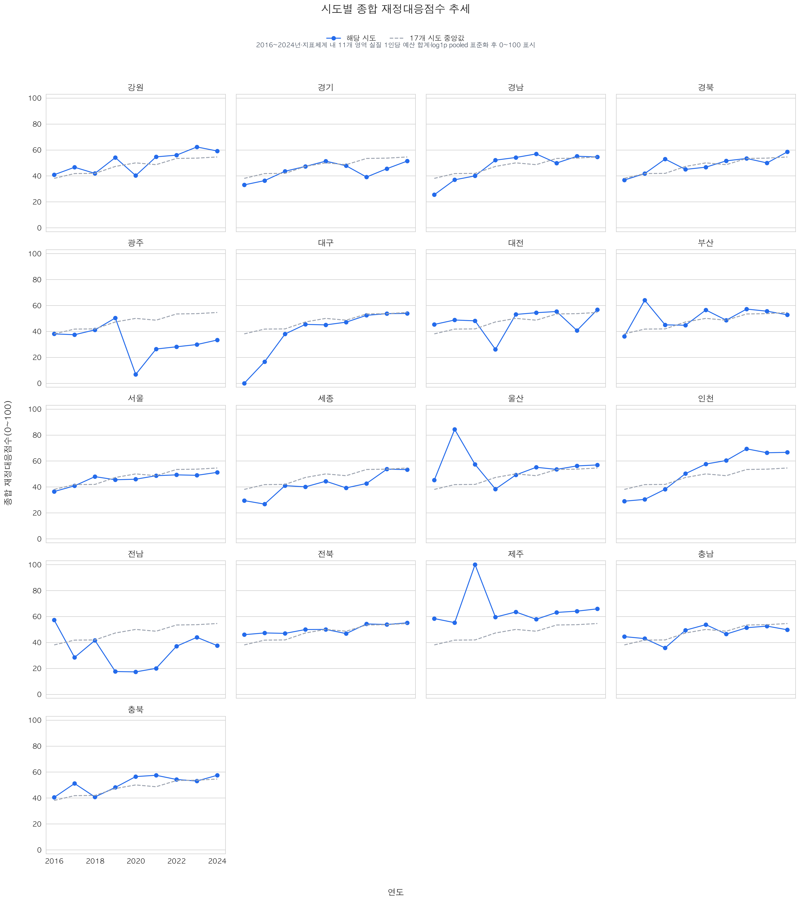
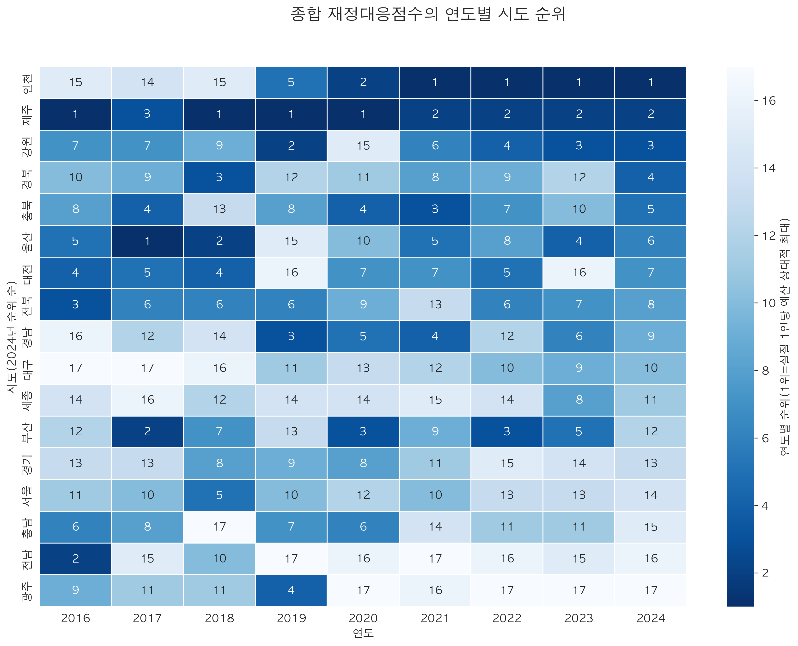
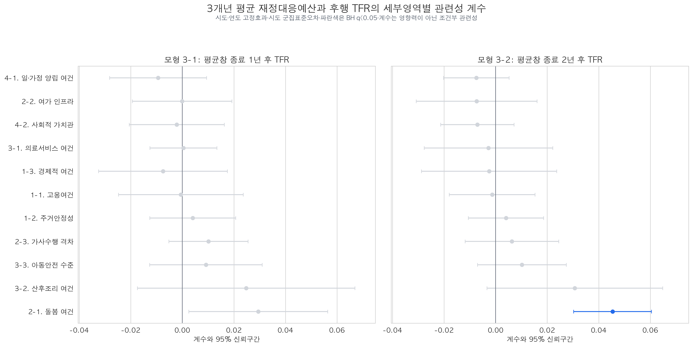

# #107 최종 분석결과 시각화 요약

## 1. 구조환경 종합지수와 합계출산율

- 17개 시도별로 2016~2024년 구조환경 pooled 종합지수와 합계출산율을 각각 시도 내 z-score로 표준화했다.
- 패널 제목의 `r`은 9개 동시점 Pearson 상관으로, 두 추세의 방향 유사성을 보는 기술적 지표일 뿐 인과효과를 뜻하지 않는다.
- 모든 시도에서 동시점 상관은 음수였고 범위는 `-0.96~-0.83`이었다. 이는 분석기간에 구조환경 종합지수가 대체로 상승한 반면 TFR은 전국적으로 하락한 공통 시간추세의 결과다. 따라서 `구조환경 개선이 TFR을 낮췄다`고 해석하지 않는다.

### 1.1 같은 연도 안에서의 시도 순위 비교

- 연도마다 구조환경 종합지수와 TFR을 각각 17개 시도 순위로 바꾸고, `1위=100점`, `17위=0점`으로 표시했다.
- 연도별 Spearman 순위상관은 `+0.46~+0.60`이었다. 즉 같은 연도 안에서는 구조환경 순위가 높은 시도가 TFR 순위도 높은 경향이 중간 정도로 나타났다.
- 산점도의 우상단은 두 순위가 모두 높은 지역, 좌하단은 두 순위가 모두 낮은 지역이다. 대각선에서 멀수록 두 순위의 차이가 크다.
- 순위차이 히트맵의 셀은 `구조환경 순위/TFR 순위`이며 옅을수록 두 순위가 유사하다. 충북·전남·인천·제주 등은 평균적으로 두 순위가 비교적 가까웠고, 광주·울산·전북은 차이가 상대적으로 컸다.
- 시도별 궤적은 연도별 위치 변화와 순위의 지속성을 함께 보여준다. 이는 지역 간 상대 순위의 기술적 비교이며, 구조환경이 TFR을 변화시켰다는 인과관계나 절대 수준의 충분성을 뜻하지 않는다.

## 2. 시도별 종합 재정대응점수

- `지표체계 외`을 제외한 11개 세부영역의 실질 1인당 예산을 합산했다.
- 합계액에 `log1p`를 적용한 뒤 17개 시도×9개년 전체를 pooled 표준화하고, 표시용으로 0~100점으로 환산했다.
- 이 점수는 구조환경 AHP 가중치를 적용한 지표가 아니며, 해당 시도에 투입된 지표체계 내 실질 1인당 예산의 상대적 수준을 나타낸다.
- 2024년 순위는 인천·제주·강원 순으로 높았고 전남·광주가 상대적으로 낮았다. 이 순위는 정책 성과가 아니라 지표체계 내 실질 1인당 계획예산의 상대 순위다.

## 3. 3개년 평균예산과 후행 TFR

- 왼쪽은 3개년 평균창 종료 1년 후 TFR, 오른쪽은 2년 후 TFR 결과다.
- 가로선은 95% 신뢰구간이고 파란점은 11개 영역의 다중검정을 BH 방식으로 보정한 후에도 `q<0.05`인 결과다.
- 계수는 정책의 인과적 영향력 순위가 아니라 시도·연도 고정효과를 고려한 조건부 관련성 계수다.
- t+1에서는 BH 보정 후 유의한 영역이 없었고, t+2에서는 돌봄 여건만 양의 계수 `0.0454`(`q=0.000103`)가 유지됐다.

## 4. 재현성 메타데이터

- 분석기간·규모: 2016~2024년, 17개 시도
- 구조환경 입력: `result/구조환경지수_시각화/구조환경지수_지역연도_요약.csv` (SHA-256 `f45263b642b54f4bef8974ba09e9bd8e11c6a2688a6d5cecf8b7ca5c7083613a`)
- 재정대응 입력: `data/processed/analysis/2016-2024_세부영역별_인구1인당_실질예산액.csv` (SHA-256 `734fd55c4ae5a8dc1a466fee156557315c570151a4fa449114e7d66feb08d759`)
- TFR 입력: `data/processed/analysis/2016-2024_재정대응지수_패널.csv`의 시도×연도 TFR 컬럼 (SHA-256 `495ea07a790af6fde4a9765a01ed3bbe0c58653c0cd58589620f571ee3e40b9c`)
- 이동평균 회귀결과: `data/processed/analysis/2016-2024_세부영역별_3개년평균예산_TFR_고정효과_결과.csv` (SHA-256 `0dcbfd77534c8759f318fffd425a1f6762ee70089dfc2b98e03fc4c2b43a0f2f`)
- 산출 기준일: 2026-08-08
- 사용 지표: 시도 내 Pearson 상관, 연도별 Spearman 순위상관, 절대 순위차이, 회귀계수·95% 신뢰구간·BH 보정 q값
- 데이터 분할·CV fold: 해당 없음(저장된 전체 패널 기술 시각화와 기존 회귀결과의 재표현이며 예측모형 학습이 아님)
- 핵심 제약: 계획예산은 집행액이 아니며, 시행계획 기록방식의 연도별 변화와 일부 예산누락의 영향을 받을 수 있음

## 5. 재현 경로

- 실행: `.venv/bin/python scripts/build_final_analysis_visualizations.py`
- 구조환경–TFR 표: `data/processed/analysis/2016-2024_시도별_구조환경종합지수_TFR_표준화추세.csv`
- 종합 재정대응점수 표: `data/processed/analysis/2016-2024_시도별_종합재정대응점수_추세.csv`
