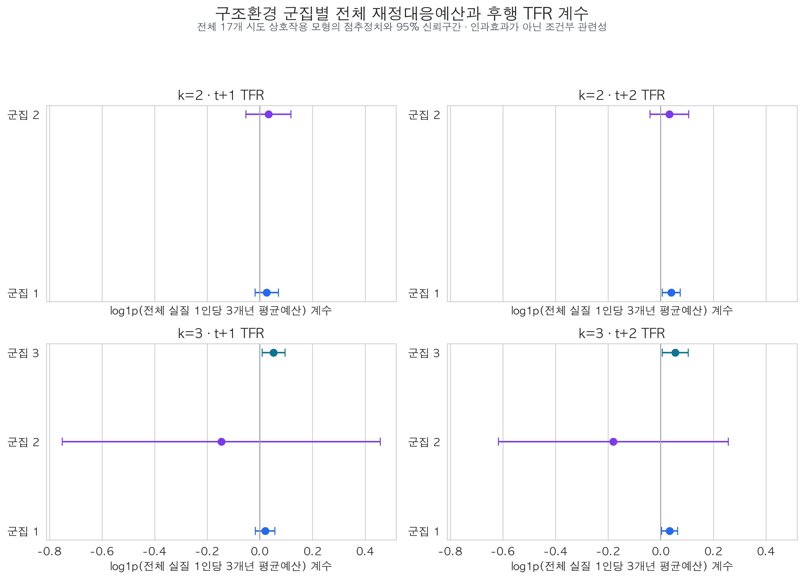
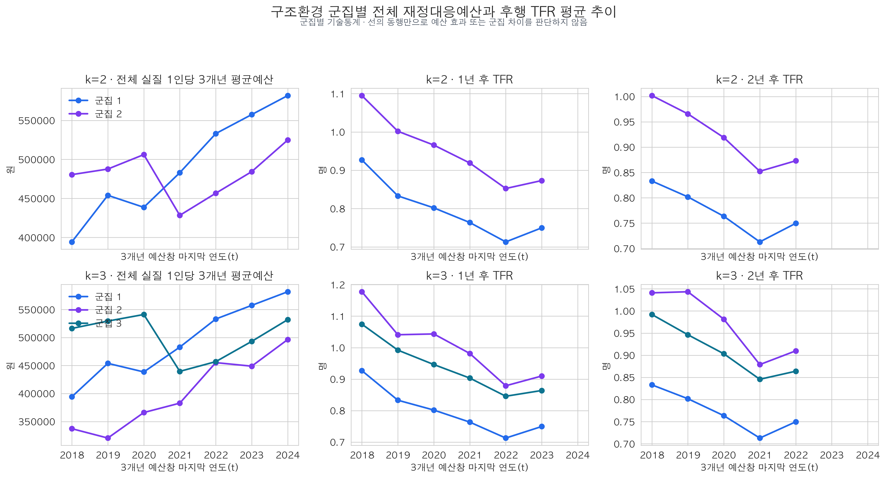

# 구조환경 군집별 전체 재정대응예산과 후행 합계출산율 관계

## 결론

11개 세부영역을 합산한 전체 재정대응예산의 3개년 평균과 이후 합계출산율(TFR)의 관계가 구조환경 유형에 따라 다른지 분석했다. 본분석인 2개 군집에서 두 군집의 계수 차이는 t+1과 t+2 모두 통계적으로 확인되지 않았다. 따라서 현재 자료로는 **전체 재정대응예산과 후행 TFR의 관련성이 구조환경 유형에 따라 다르다고 말할 근거가 없다.**

k=3에서는 대전·세종을 제외한 군집 3의 계수가 양수로 나타났지만, 대전·세종 2개 시도로 구성된 군집의 불안정성이 크고 모든 군집 간 직접 차이가 유의하지 않았다. 이는 확정적 유형 차이가 아니라 민감도 분석 결과로만 제시한다.



## 1. 분석 질문과 기존 분석과의 차이

기존 구조환경 군집 분석은 11개 세부영역의 예산을 각각 설명변수로 사용했다. 전체예산 합계는 군집별 추세를 설명하는 기술통계에만 사용했다. 이번 분석은 다음 질문에 답하기 위해 11개 영역 예산을 하나로 합산했다.

> 동일한 구조환경 유형 안에서 전체 재정대응예산이 증가했을 때 이후 TFR의 변화 방향은 어떠하며, 그 관계가 구조환경 유형 간에 다른가?

이는 개별 정책영역의 관련성이 아니라 지역의 **전체적인 재정대응 강도**와 후행 TFR의 관계를 비교한다. 결과는 인과효과나 정책성과가 아니라 시도·연도 고정효과를 적용한 조건부 관련성이다.

## 2. 데이터와 변수

- 분석기간: 2016~2024년 예산 자료
- 분석단위: 17개 시도 × 3개년 예산창 마지막 연도
- 예산변수: 11개 세부영역별 실질 1인당 예산의 3개년 이동평균 합계
- 변환: `log1p(전체 실질 1인당 3개년 평균예산)`
- 결과변수: 예산창 마지막 연도보다 1년 또는 2년 후 TFR
- 구조환경 유형: #103에서 확정한 2016~2024년 평균 구조환경의 k=2 본분석 군집과 k=3 민감도 군집
- 표본: t+1은 102개 관측치(17개 시도×6년), t+2는 85개 관측치(17개 시도×5년)

전체예산은 각 지역×연도에 11개 세부영역이 모두 존재하고 이동평균값이 모두 유효한 경우에만 합산했다. 일부 영역의 결측을 0으로 바꿔 합계를 낮추지 않았다.

## 3. 모형

군집별 부분표본 모형은 다음과 같다.

`TFR(i,t+h) = β(c) × log1p(MA3 전체예산(i,t)) + 시도 FE + 연도 FE + 오차`

군집 차이는 전체 17개 시도를 유지한 상호작용 모형으로 직접 검정했다.

`TFR(i,t+h) = β × 예산(i,t) + δ × 예산(i,t)×군집(c) + 시도 FE + 연도 FE + 오차`

- h=1, 2를 모두 추정했다.
- 표준오차는 시도 단위로 군집화했다.
- 여러 군집·시차 결과를 함께 검토하므로 군집 수별 결과군에 Benjamini–Hochberg 보정을 적용했다.
- 군집 주효과는 시도 고정효과에 흡수되므로 별도로 추정하지 않았다.

## 4. 본분석: k=2에서는 군집 간 차이를 확인하지 못했다

### 4.1 군집별 부분표본

| 시차 | 군집 | 계수 | p값 | 관측치 | 지역수 |
|---|---:|---:|---:|---:|---:|
| t+1 | 1 | 0.0089 | 0.7820 | 42 | 7 |
| t+1 | 2 | 0.0361 | 0.3957 | 60 | 10 |
| t+2 | 1 | 0.0258 | 0.2669 | 35 | 7 |
| t+2 | 2 | 0.0317 | 0.3679 | 50 | 10 |

네 계수는 모두 양수지만 95% 신뢰구간이 0을 포함한다. 이는 군집별 부분표본에서 전체예산이 많은 시기에 후행 TFR이 높아지는 방향은 보였으나, 불확실성이 커 관계를 통계적으로 확인하지 못했다는 뜻이다.

### 4.2 전체표본 상호작용 모형

| 시차 | 군집 1 계수 | 군집 2 계수 | 군집 2−1 차이 | 차이 p값 |
|---|---:|---:|---:|---:|
| t+1 | 0.0261 | 0.0325 | 0.0064 | 0.9089 |
| t+2 | 0.0399 | 0.0327 | -0.0072 | 0.8743 |

t+1과 t+2 모두 두 군집의 계수 차이는 거의 0에 가깝고 p값도 매우 크다. 즉 한 군집의 계수가 다른 군집보다 뚜렷하게 크다고 볼 수 없다. 상호작용 모형에서 군집 1의 t+2 계수는 보정 전 p=.024였지만, 군집 수별 다중검정 보정 후 유의하지 않았고 군집 간 차이도 없었다. 따라서 이를 군집 1만의 정책 관련성으로 해석하지 않는다.

## 5. 민감도 분석: k=3 결과는 소군집 때문에 불안정하다

k=3에서 군집 2는 대전·세종 2개 시도로만 구성된다. 부분표본에서는 계수만 산출하고 p값·신뢰구간 추론은 하지 않았다.

- 군집 1: t+1 0.0089, t+2 0.0258
- 군집 2(대전·세종): t+1 -0.1377, t+2 -0.2339 — 점추정치만 탐색
- 군집 3: t+1 0.0537, t+2 0.0542

전체표본 상호작용 모형에서도 군집 3 계수는 양수였지만, 군집 3−1 차이는 t+1 0.0320(p=.2735), t+2 0.0214(p=.4929)로 유의하지 않았다. 대전·세종이 포함된 모든 비교도 신뢰구간이 매우 넓고 유의하지 않았다. 따라서 k=3 결과는 유형 간 차이의 근거가 아니라 소군집 추정의 불확실성을 보여주는 민감도 결과다.

## 6. 기술통계 추세



2개 군집 모두 전체 실질 1인당 3개년 평균예산이 장기적으로 증가했지만 TFR은 전반적으로 하락했다. 이 전국 공통 흐름은 연도 고정효과가 제거하는 대상이다. 따라서 그림에서 예산선과 TFR선이 반대로 움직인다는 이유만으로 예산이 TFR을 낮췄다고 해석하지 않는다. 회귀계수는 같은 시도의 평소 수준과 공통 연도 충격을 제거한 뒤 남은 지역 내 변동을 이용한다.

## 7. 해석과 한계

1. 전체예산 합계는 어느 영역에 예산이 투입됐는지를 구분하지 못한다. 서로 다른 정책영역의 양·음 관계가 합계에서 상쇄될 수 있다.
2. 3개년 이동평균은 단년도 기록 변동을 완화하지만, 시행계획 사업의 통합·분리·누락과 계획예산·집행액 차이를 제거하지 않는다.
3. 17개 시도와 5~6개 회귀시점은 군집별 이질성을 정밀하게 추정하기에 작다. 특히 k=3의 대전·세종 군집은 추론용으로 사용할 수 없다.
4. 시도·연도 고정효과와 시차를 적용했어도 누락변수, 선택적 예산편성, 수요반응적 예산 증가 등 내생성을 해결하지 못한다.
5. 유의하지 않은 차이는 두 군집이 완전히 동일하다는 증명이 아니라, 현재 자료로 차이를 확인하지 못했다는 뜻이다.

## 8. 재현성 메타데이터

- 분석 기준일: 2026-08-08 KST
- 입력 예산·TFR 표본 SHA-256: `b0b9063f2d465626ea1884b438a4529d6e7bc7a0b18c0f623599a5f76cc7512a`
- 입력 구조환경 군집 SHA-256: `95b85f34fd9bbcaf7bc529443a04d3280236c59dd1f4918007c09257c4be4b67`
- 데이터 분할: 없음. 예측모형이 아닌 전체 가용 패널의 고정효과 추론 분석
- CV fold: 해당 없음
- 난수: 회귀분석에는 난수 사용 없음. 군집 배정은 #103의 고정 결과를 재사용
- 실행 스크립트: `scripts/run_cluster_total_fiscal_tfr_regression.py`
- 시각화 스크립트: `scripts/build_cluster_total_fiscal_tfr_visualizations.py`
- 단위 테스트: `tests/test_run_cluster_total_fiscal_tfr_regression.py`, `tests/test_build_cluster_total_fiscal_tfr_visualizations.py`
- 결과표: `data/processed/analysis/2016-2024_구조환경군집별_전체3개년평균예산_TFR_부분표본결과.csv`, `data/processed/analysis/2016-2024_구조환경군집_전체예산상호작용_TFR_계수.csv`, `data/processed/analysis/2016-2024_구조환경군집_전체예산상호작용_TFR_계수차이.csv`

## 9. 실행 방법

```bash
uv run python scripts/run_cluster_total_fiscal_tfr_regression.py
uv run python scripts/build_cluster_total_fiscal_tfr_visualizations.py
uv run pytest -q tests/test_run_cluster_total_fiscal_tfr_regression.py tests/test_build_cluster_total_fiscal_tfr_visualizations.py
```
