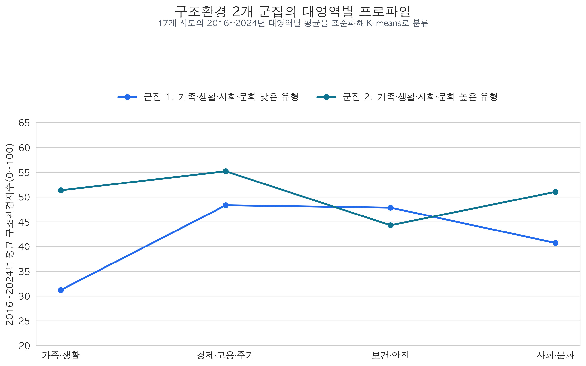
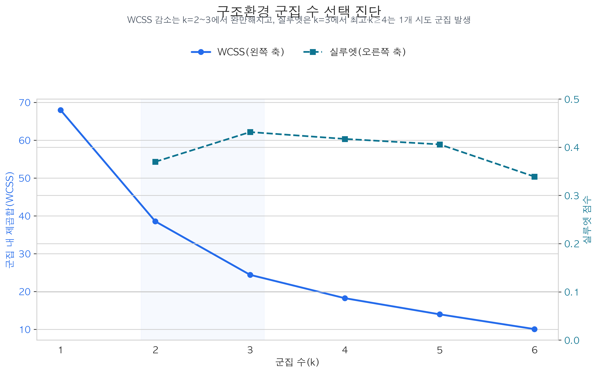
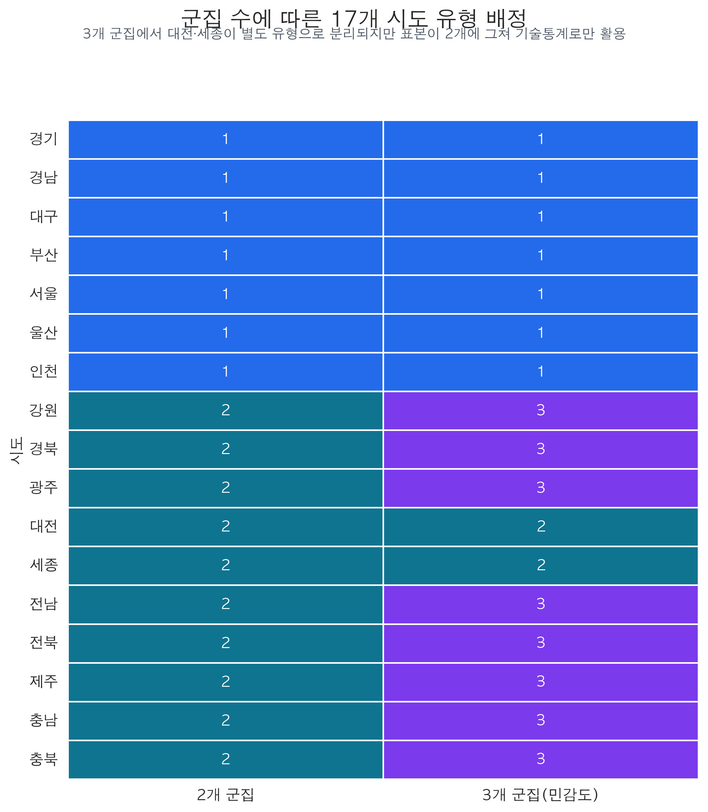
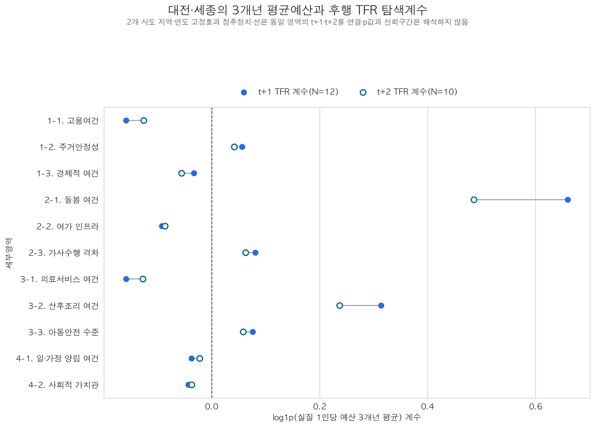
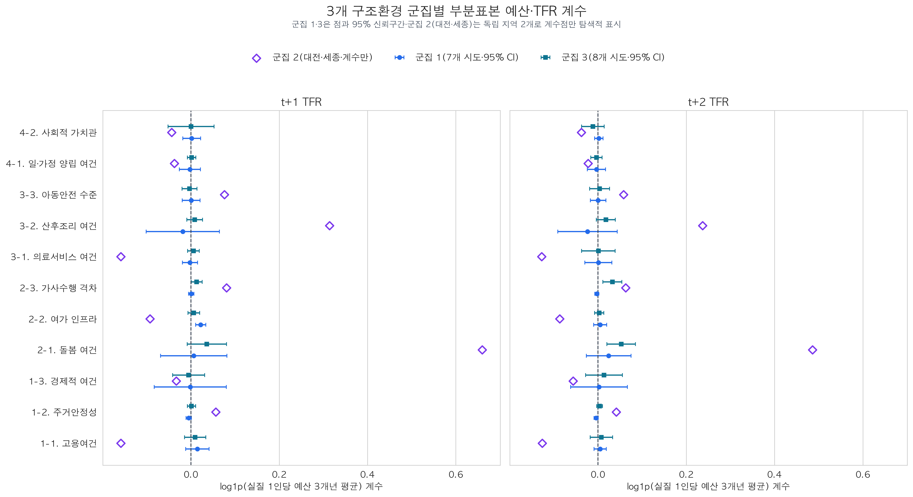
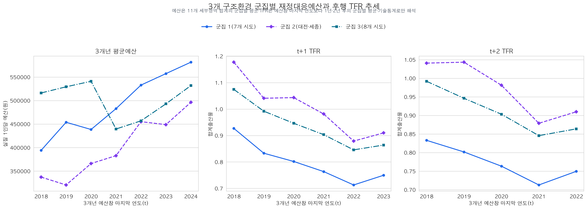
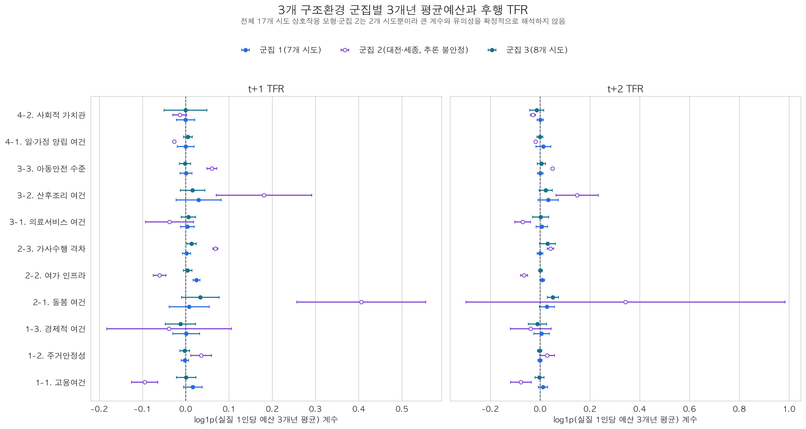
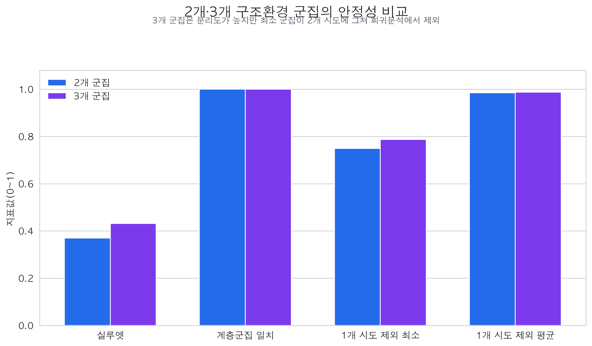
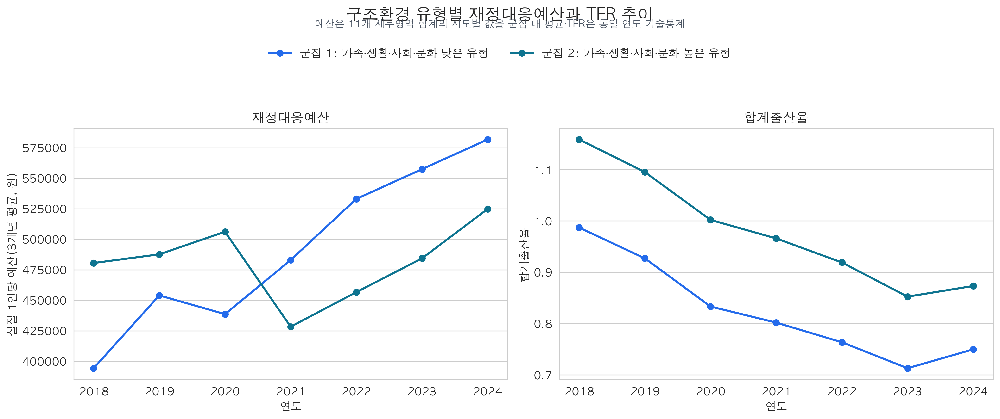
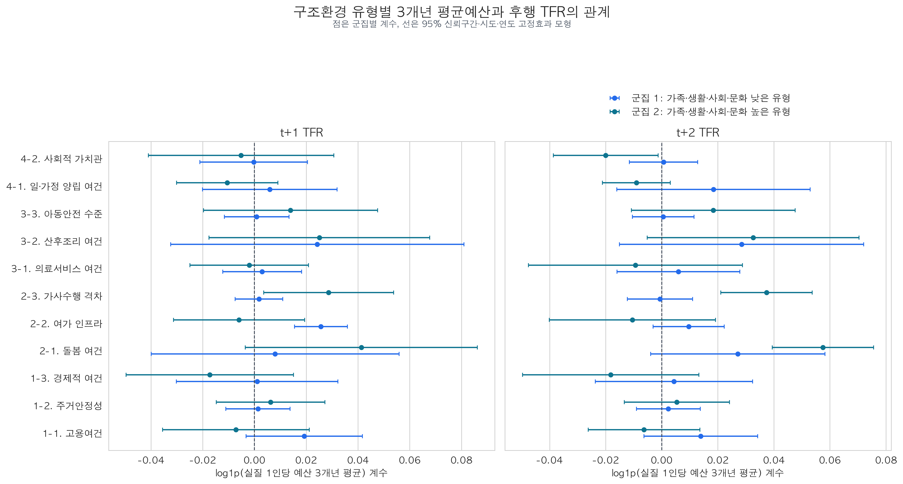

# 구조환경 유형별 재정대응예산과 합계출산율 관계 분석

## 기술 요약

- 17개 시도의 2016~2024년 구조환경 평균을 이용해 2개 유형으로 분류했다. 군집 1은 가족·생활과 사회·문화 수준이 상대적으로 낮았고, 군집 2는 두 대영역이 상대적으로 높았다.
- WCSS 엘보우는 k=2~3 구간을 후보로 보여주고, 실루엣 점수는 k=3에서 가장 높았다(0.431). 그러나 k=3은 대전·세종 2개 시도만의 군집을 만들었고 k≥4는 1개 시도 군집을 만들었다. 따라서 k=2는 엘보우값 하나로 자동 선택한 것이 아니라, 분리도·안정성·최소 군집 크기·후속 회귀 가능성을 함께 고려한 본분석용 선택이다.
- 군집별 부분표본 회귀에서는 군집 1의 여가 인프라 예산과 t+1 TFR, 군집 2의 돌봄 예산·가사수행 격차 예산과 t+2 TFR에서 양(+)의 관계가 BH 보정 후 남았다. 이 결과는 군집별 표본이 7개와 10개 시도로 작아 탐색 결과로만 본다.
- 군집 간 계수 차이를 전체 17개 시도 상호작용 모형으로 직접 검정하면, **t+2 가사수행 격차 예산**만 다중검정 보정 후에도 차이가 남았다(군집 간 계수 차이 0.0381, p=0.0008, q=0.0091). 다른 영역은 군집별 계수가 달라 보여도 차이를 통계적으로 확인하지 못했다.
- 따라서 “구조환경 유형에 따라 모든 재정대응의 TFR 관련성이 다르다”고 일반화할 수는 없다. 확인된 것은 가사수행 격차 영역의 한 개 탐색 신호이며, 인과효과나 정책효과 순위를 의미하지 않는다.

## 재현성 메타데이터

- **분석 기준일**: 2026-08-08 (한국표준시)
- **재현 기준 커밋**: `ac3a9b2` (`feat: 3개 군집 탐색계수와 추세 시각화 추가 (#103)`)
- **입력 데이터 버전 커밋**: `a453cd92a1e9167fffe79eb75cb23ae97c313b5e` (2026-08-08 04:12:47 KST)
- **구조환경·군집 입력**: `data/processed/analysis/2016-2024_시도별_구조환경_군집.csv`
- **예산·TFR 회귀표본**: `data/processed/analysis/2016-2024_세부영역별_3개년평균예산_TFR_회귀표본.csv`
- **결과 생성 스크립트**: `scripts/run_cluster_fiscal_tfr_regression.py`
- **시각화 생성 스크립트**: `scripts/build_cluster_fiscal_tfr_visualizations.py`
- **구조환경 군집화 기간**: 2016~2024년 17개 시도의 4개 대영역 지수
- **예산 이동평균창**: 2018~2024년을 마지막 연도로 하는 3개년 평균
- **회귀 분석 가용 예산창**: t+1 TFR 모형은 2018~2023년, t+2 TFR 모형은 2018~2022년
- **데이터 분할 전략**: 없음. 예측성능 평가가 아니라 시도·연도 고정효과를 이용한 패널자료의 조건부 관련성 추정이 목적이므로, 시차·결측 조건을 적용한 전체 가용 패널을 사용했다.
- **교차검증(CV) fold 수**: 해당 없음. 본 분석은 예측모형의 외부 성능 평가가 아니므로 train/validation/test 분할과 CV를 적용하지 않았다.
- **보고 통계량**: 회귀계수, 시도 군집표준오차, 95% 신뢰구간, p값, Benjamini–Hochberg FDR 보정 q값. 대전·세종 2개 시도 부분표본은 계수 점추정치만 보고하고 표준오차·p값·신뢰구간은 보고하지 않았다.
- **핵심 가정·제약**: 군집은 분석기간 평균으로 고정된다. 예산 분류와 시행계획 기록의 연도별 비일관성, 17개 시도 소표본, 누락변수·선택적 예산편성·예산과 집행액의 차이로 인해 인과효과로 해석하지 않는다. 세부 한계와 잠재 편향은 아래 7절에 기록했다.

## 1. 2개 군집은 가족·생활과 사회·문화 수준에서 가장 크게 구분됐다

군집은 각 시도의 2016~2024년 4개 대영역 구조환경지수 평균을 표준화한 뒤 K-means로 구성했다. 군집 1은 가족·생활 31.23점, 사회·문화 40.74점으로 군집 2의 51.36점, 51.04점보다 낮았다. 보건·안전은 군집 1이 47.85점으로 군집 2의 44.30점보다 소폭 높았다.

군집 1은 경기·경남·대구·부산·서울·울산·인천 7개 시도, 군집 2는 강원·경북·광주·대전·세종·전남·전북·제주·충남·충북 10개 시도다. 이 이름은 군집의 지리적 본질을 선언하는 것이 아니라, 관측된 군집 중심의 차이를 요약한 표현이다.

## 2. 엘보우와 실루엣은 k=2·3을 후보로 가리킨다

표준화한 4개 대영역 프로파일에서 WCSS는 k=1의 68.00에서 k=2의 38.55, k=3의 24.41, k=4의 18.23으로 감소했다. k=3 이후에는 감소 폭이 상대적으로 완만해져 엘보우는 k=2~3 사이의 선택을 지지한다. 실루엣 점수는 k=2 0.370, k=3 0.431, k=4 0.417, k=5 0.406, k=6 0.339로 k=3에서 가장 높았다.

다만 k=4~6은 최소 군집 크기가 1개 시도였고, k=3도 최소 군집이 2개 시도였다. 군집의 수학적 분리도만 보면 k=3이 우세하지만, 군집별 시도 클러스터 표준오차를 계산해야 하는 후속 모형을 함께 고려하면 k=2가 본분석에 더 적합하다.

## 3. k=3은 대전·세종을 별도 유형으로 나누지만 추론은 불안정하다

3개 군집으로 나누면 기존 군집 1의 7개 시도는 그대로 유지되고, 대전과 세종이 별도 군집 2로 분리되며, 나머지 8개 시도가 군집 3이 된다. 이는 k=2의 10개 시도 군집 안에서 대전·세종의 구조환경 프로파일이 다른 8개 시도와 구분된다는 뜻이다.

k=3 부분표본 회귀도 실행했다. 대전·세종 군집은 독립 지역이 2개뿐이어서 시도 군집표준오차를 계산하지 않았다. 다만 관계의 방향과 크기를 확인하기 위해 지역·연도 고정효과 OLS 점추정치는 별도로 산출했다. 해당 22개 결과(t+1·t+2×11개 영역)의 표준오차·p값·신뢰구간은 제시하지 않고 `2개 시도 계수만 탐색`으로 표시했다.

대전·세종 계수의 부호는 t+1과 t+2의 11개 영역에서 모두 일치했다. 양(+)의 방향은 주거안정성·돌봄 여건·가사수행 격차·산후조리 여건·아동안전 수준이었고, 음(-)의 방향은 고용여건·경제적 여건·여가 인프라·의료서비스 여건·일·가정 양립 여건·사회적 가치관이었다. 특히 돌봄(t+1 0.6598, t+2 0.4859)과 산후조리(t+1 0.3138, t+2 0.2369)는 비교적 큰 양의 계수를 보였다. 그러나 이 일관성은 관계의 방향에 대한 탐색 근거일 뿐, 통계적 유의성이나 정책효과의 근거로 사용하지 않는다.

아래 그림은 같은 부분표본 회귀를 3개 군집 모두에 대해 비교한다. 군집 1과 3은 95% 신뢰구간을 함께 표시하고, 대전·세종으로 구성된 군집 2는 점추정치만 표시한다. 따라서 군집 2의 점은 다른 군집과의 방향·크기 비교용이지 유의성 비교용이 아니다.

군집별 수준과 시간적 흐름을 확인하기 위해 11개 세부영역의 실질 1인당 3개년 평균예산 합계와 t+1·t+2 TFR 평균을 함께 제시했다. 세 선의 수준이나 방향은 군집별 기술통계이며, 선이 함께 움직이는 모습만으로 예산의 효과를 판단하지 않는다.

전체 17개 시도를 유지하는 3군집 상호작용 모형은 수치를 산출할 수 있었다. 그러나 대전·세종 계수는 두 지역의 시계열에 거의 전적으로 의존하여 일부 영역에서 과도하게 큰 계수와 많은 유의성을 만들었다. 이는 k=3이 더 좋은 정책적 분류라는 근거가 아니라, 소군집 추론의 불안정성을 보여주는 경고 결과다.

대전·세종을 제외한 군집 1과 군집 3의 직접 차이에서는 t+1 여가 인프라만 BH 보정 후 남았고(군집 3-군집 1=-0.0204, q=0.0033), t+2에서는 보정 후 유의한 차이가 없었다. k=3 부분표본에서는 군집 1의 t+1 여가 인프라, 군집 3의 t+2 돌봄·가사수행 격차가 보정 후 유의했다. 즉 k=2에서 관측된 대한 패턴의 일부는 대전·세종을 분리해도 유지됐지만, k=3 전체를 동등한 회귀 결과로 해석하지는 않는다.

초기값을 바꿔 반복한 K-means와 Ward 계층적 군집 결과는 2개·3개 군집 모두 기준 결과와 일치했다(ARI=1.0). 한 시도씩 제외한 재분류 ARI도 2개 군집 평균 0.985, 3개 군집 평균 0.988이었다. 이는 현재 자료에서 분류가 알고리즘 초기값에 크게 의존하지 않음을 보여주지만, 17개라는 소표본 문제를 없애지는 않는다.

## 4. 군집별 예산과 TFR의 수준 차이는 회귀계수 차이와 같은 뜻이 아니다

3개년 평균을 구성할 수 있는 2018~2024년 기술통계에서 군집 1의 11개 영역 합계 실질 1인당 예산 평균은 약 39.4만~58.2만 원, 군집 2는 약 42.8만~52.5만 원의 범위였다. 같은 기간 TFR 군집 평균은 군집 1이 0.713~0.987, 군집 2가 0.852~1.159였다.

이 그래프는 군집의 평균 수준과 흐름을 설명하는 기술통계다. 예산과 TFR 두 선의 수준이 같이 움직이는지만으로 정책 반응이나 효과를 판단할 수 없다. 회귀분석은 각 시도의 평소 수준과 각 연도의 공통 충격을 제거한 뒤, 같은 시도 내의 예산 변화와 후행 TFR 변화가 어떤 관계인지를 별도로 추정한다.

## 5. 부분표본의 유의성과 군집 간 차이는 구분해야 한다

군집별로 같은 시도·연도 고정효과 모형을 반복하고, 각 시차·군집의 11개 세부영역 검정에 Benjamini–Hochberg 보정을 적용했다. 부분표본에서 q<0.05인 결과는 다음 세 개였다.

| 시차 | 군집 | 세부영역 | 계수 | p값 | q값 | 관측치/지역 |
|---|---:|---|---:|---:|---:|---:|
| t+1 | 1 | 여가 인프라 | 0.0222 | 0.0034 | 0.0374 | 42/7 |
| t+2 | 2 | 돌봄 여건 | 0.0516 | 0.0079 | 0.0433 | 50/10 |
| t+2 | 2 | 가사수행 격차 | 0.0397 | 0.0008 | 0.0093 | 50/10 |

그러나 “군집 2에서 돌봄 계수가 유의하다”는 것과 “돌봄 계수가 군집 1과 군집 2 사이에서 유의하게 다르다”는 것은 다른 주장이다. 두 군집의 차이를 직접 검정하기 위해 전체 17개 시도 표본에 `3개년 평균예산 × 군집` 상호작용항을 추가했다.

상호작용 모형에서 군집 간 차이를 11개 영역 내에서 BH 보정한 결과, t+2 가사수행 격차만 유의했다. 군집 1의 계수는 -0.0007(95% CI -0.0123~0.0110), 군집 2는 0.0374(95% CI 0.0211~0.0537)였고, 두 계수의 차이는 0.0381(p=0.0008, q=0.0091)이었다. t+2 돌봄 여건은 군집 2 계수가 0.0575로 양수였지만 군집 간 차이의 q값은 0.2755였다. 따라서 돌봄 관계가 군집 2에서만 작동한다고 결론내리지 않는다.

## 6. 데이터·지표·모형 정의

- **군집 단위**: 17개 시도. 시도×연도 153개 행을 독립 군집 표본으로 사용하지 않았다.
- **군집 변수**: 2016~2024년 경제·고용·주거, 가족·생활, 보건·안전, 사회·문화 대영역 지수의 시도별 평균.
- **예산 변수**: 각 연도 명목예산을 전국 CPI(2024=100)로 실질화하고, 해당 연도 전체 주민등록인구로 나눈 뒤, 최근 3개년의 평균에 `log1p`를 적용했다.
- **종속변수**: 3개년 평균 창의 마지막 연도보다 1년 또는 2년 후의 합계출산율.
- **기본 모형**: 군집별 시도 고정효과+연도 고정효과+시도 군집표준오차.
- **직접 차이 검정**: 전체 표본의 예산×군집 상호작용 모형. 군집 주효과는 시도 고정효과에 흡수되므로 별도로 추정하지 않았다.
- **다중검정**: 각 시차의 11개 세부영역 군집 간 차이에 Benjamini–Hochberg FDR 보정을 적용했다.

## 7. 제한과 불확실성

1. **17개 시도 소표본**: 군집 1은 7개, 군집 2는 10개 시도로 구성된다. 특히 군집별 회귀의 표준오차와 p값은 제한된 지역 수에 민감하다.
2. **군집의 시간 고정**: 2016~2024년 평균으로 분류했으므로, 해당 기간 중 시도의 유형이 변하지 않았다고 가정한다. 연도별 재군집 결과는 장기평균 분류와 완전히 같지 않았으므로, 군집을 불변의 지역 특성으로 보지 않는다.
3. **예산 원자료의 변동성**: 시행계획의 사업명·사업범위·예산 기록이 연도별로 통합·분리·누락되는 문제가 있다. 3개년 평균은 단년도 변동을 완화하지만 원자료의 비일관성을 제거하지는 못한다.
4. **인과해석 불가**: 고정효과와 시차를 사용했지만, 누락변수·정책의 선택적 편성·예산 집행과 편성의 차이·출산율 하락에 대한 예산 반응성을 모두 해결하지 못했다.
5. **탐색 후 재검증 필요**: 가사수행 격차 영역의 군집 차이는 사전에 특정한 단일 가설이 아니라 11개 영역을 비교한 후 발견된 탐색 결과다. BH 보정을 적용했어도 독립 표본이나 추가 연도로 재현성을 확인할 필요가 있다.

## 8. 권고하는 보고 방식과 후속 검토

- 본문에서는 전체 표본 상호작용 모형을 군집 간 차이의 주요 근거로 사용한다.
- 군집별 부분표본 회귀는 관계의 방향과 후보 영역을 찾는 탐색 분석으로 표시한다.
- 3개 군집은 회귀 수치를 민감도 부록에 제시하되, 대전·세종 군집의 부분표본 회귀는 계수 방향만 탐색적으로 제시하고 p값·신뢰구간은 제시하지 않는다. 전체 상호작용 계수도 확정적 추론 근거로 사용하지 않는다.
- 가사수행 격차 영역은 예산 라벨링의 연도별 일관성, 군집별 0원 관측의 비율, 특이 시도·연도의 영향을 추가 점검한다.
- 후속 데이터가 축적되면 군집 정의를 고정한 상태에서 추가 연도 예산·TFR로 가사수행 격차 상호작용을 우선 재검증한다.

## 9. 남은 질문

1. 가사수행 격차 예산 라벨이 연도별 시행계획 작성 방식의 변화에 의해 특정 군집에서 다르게 포착됐는가?
2. 군집 2의 t+2 가사수행 격차 관계는 어느 특정 시도나 연도를 제외했을 때도 유지되는가?
3. 2025년 이후 자료가 추가됐을 때 시간을 고정한 군집 분류와 군집 간 계수 차이가 재현되는가?
