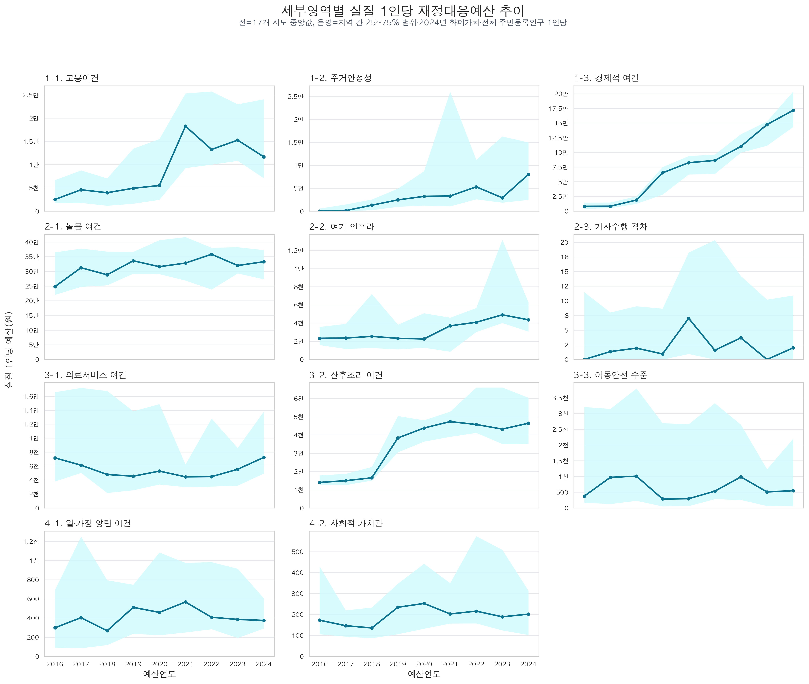
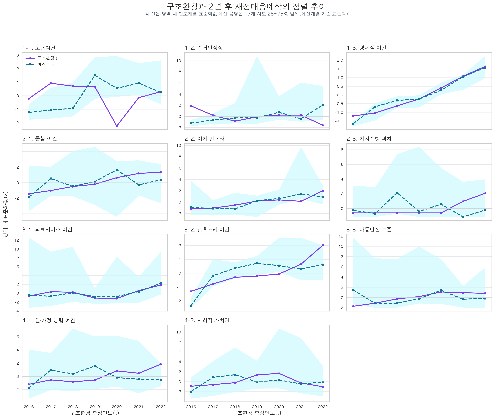
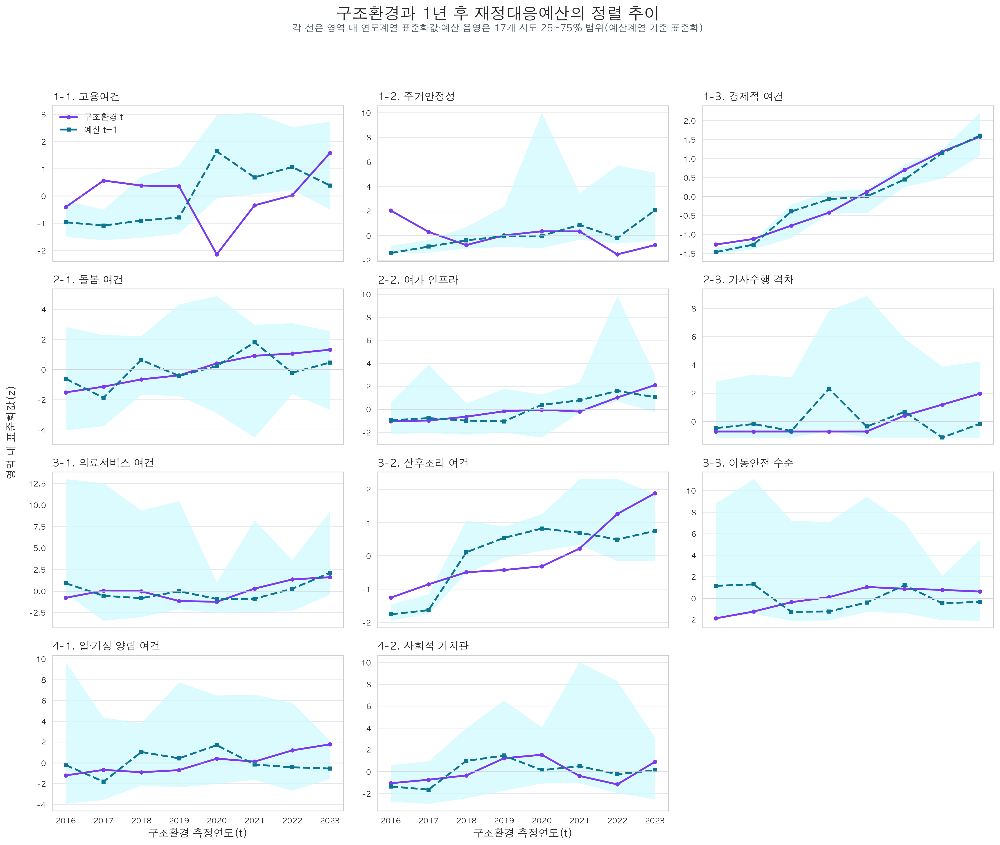
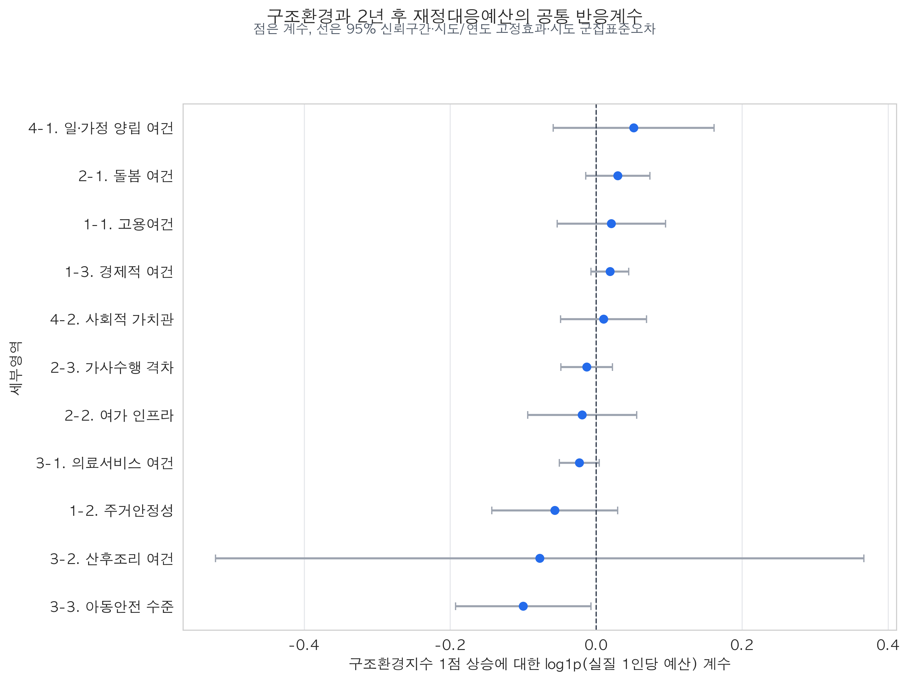
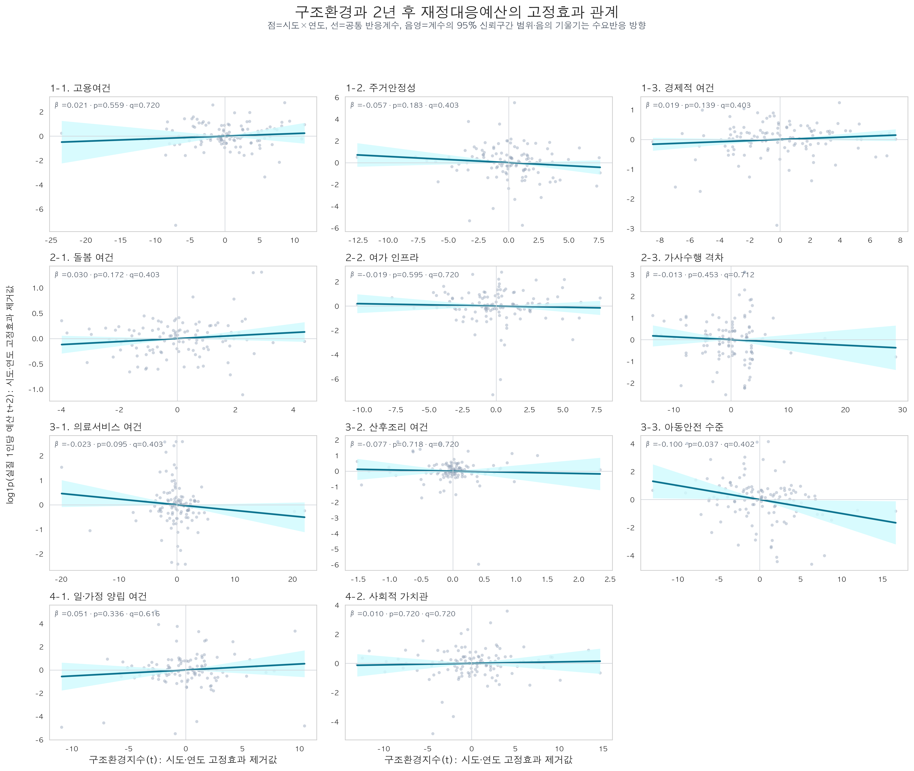
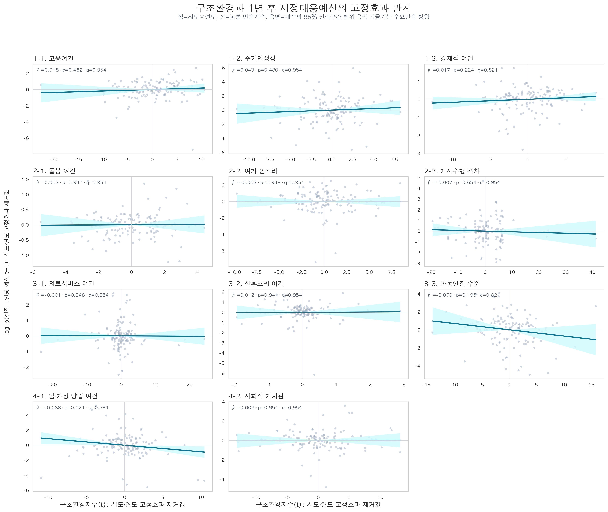
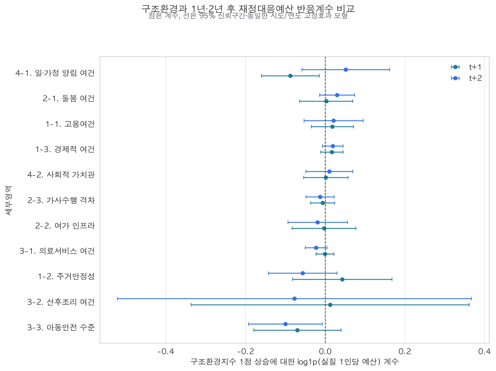
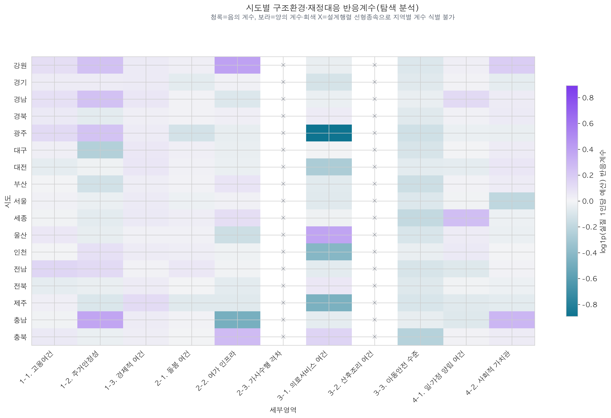

# [Regression] 구조환경과 1년·2년 후 재정대응예산의 관련성 분석 — 2026-08-08

## 1. 핵심 결론

당해 연도의 세부영역별 구조환경지수가 1년 및 2년 후 같은 영역의 실질 1인당
재정대응예산과 관련되는지를 17개 시도 패널로 분석했다. 예산편성 시점을 고려한
t+2를 주모형으로 두고, t+1은 비교·민감도 분석으로 사용한다.

- 11개 세부영역 가운데 **아동안전 수준**만 보정 전 기준에서 음(-)의 관계가
  나타났다(계수 -0.0999, p=0.0365).
- 그러나 11개 영역의 다중검정을 보정한 뒤에는 유의한 영역이 없었다
  (아동안전 FDR q=0.4017).
- t+1에서는 **일·가정 양립 여건**만 보정 전 기준에서 음(-)의 관계가 나타났으나
  (계수 -0.0876, p=0.0210), 다중검정 보정 후에는 유의하지 않았다(q=0.2315).
- 두 시차 모두 BH 보정 후 유의한 영역은 없으며, 11개 중 8개 영역에서 계수
  부호가 일치했다.
- 따라서 현재 결과는 구조환경이 취약한 지역에 예산이 일관되게 더 편성된다는
  재정반응성을 영역 전반에서 확인한 것으로 해석할 수 없다.
- 시도별 계수는 일부 영역에서 차이가 보이지만, 지역별 시점이 7개뿐이고 일부
  영역은 계수를 식별할 수 없어 탐색 결과로만 제시한다.

본 분석은 엄밀한 의미의 역인과성 검정이나 인과효과 추정이 아니다. 구조환경이라는
정책수요가 이후 예산편성에 반영되는지를 확인하는 **수요반응적 예산편성의 탐색
분석**이다.

**역방향 가능성에 관한 최종 판단은 “확인하지 못했으나 배제할 수도 없음”이다.**
일부 영역에서 취약한 구조환경 이후 예산이 증가하는 음(-)의 신호가 관찰됐지만,
다중검정 보정 후 유의하지 않았고 영역별 방향도 일관되지 않았다. 따라서
수요반응적 예산편성이라는 역방향 경로가 존재한다고 확인할 수 없으며, 현재의
짧은 패널과 계획예산 자료만으로 해당 가능성이 없다고 결론 내릴 수도 없다.

## 2. 전체 연구 흐름에서의 위치

본 연구의 최종 분석 흐름은 다음 네 단계로 구성한다.

1. 출생 구조환경지수, 영역별 예산액 및 재정대응지수를 산출하고 시도 간 상대적
   수준과 연도별 변화를 기술한다.
2. 당해 연도 구조환경과 2년 후 예산편성의 관련성을 주 분석하고, 1년 후
   예산과의 관련성을 민감도 분석한다(본 보고서).
3. 당해 연도 실질 1인당 재정대응예산과 1년·2년 후 합계출산율의 관련성을
   분석한다.
4. 단년도 예산의 큰 연도별 변동을 완화하기 위해 실질 1인당 예산의 3개년
   이동평균과 1년·2년 후 합계출산율의 관련성을 추가 분석한다.

#62에서 구축·확인한 지수와 기존 회귀 결과는 다음 보고서에 별도로 보존하며,
본 보고서가 이를 덮어쓰거나 대체하지 않는다.

- `reports/methodology/20260807_세부영역별_재정대응지수_구축_및_재정반응성_모형A_결과보고서.md`
- `reports/20260729_재정대응지수_구축_및_재정반응성_기초분석.md`

## 3. 연구질문과 모형

### 3.1 연구질문

> 같은 시도에서 특정 영역의 구조환경 수준이 달라졌을 때, 2년 후 해당 영역의
> 실질 1인당 재정대응예산도 달라졌는가?

### 3.2 시간 배열

예산은 해당 회계연도보다 앞서 편성·심의된다는 점을 고려하여 구조환경과 예산
사이에 2년을 둔 모형을 주모형으로 사용한다. t+1 모형은 구조환경 통계의 실제
공표시점과 예산편성의 선후관계가 일부 겹칠 수 있으므로 민감도 결과로 해석한다.

| 구조환경 측정연도(t) | 예산연도(t+2) |
|---:|---:|
| 2016 | 2018 |
| 2017 | 2019 |
| 2018 | 2020 |
| 2019 | 2021 |
| 2020 | 2022 |
| 2021 | 2023 |
| 2022 | 2024 |

t+1 민감도 분석은 2016~2023년 구조환경과 2017~2024년 예산을 연결한다.

### 3.3 기본모형

```text
log(1 + 실질 1인당 예산_i,k,t+h)
  = β_k × 구조환경지수_i,k,t + 시도 고정효과_i + 예산연도 고정효과_t+h + 오차_i,k,t
```

여기서 주모형은 `h=2`, 민감도 모형은 `h=1`이다.

- 분석단위: 시도(i) × 세부영역(k) × 구조환경연도(t)
- 설명변수: t년의 세부영역별 구조환경지수
- 종속변수: t+2년의 같은 영역 실질 1인당 재정대응예산의 `log1p` 값
- 고정효과: 시도 및 예산연도
- 표준오차: 시도 단위 군집표준오차, 유한표본 보정과 t분포 추론
- 추가 통제변수: 없음
- 가중치 및 결측 처리: 구조환경지수 구축 단계의 기존 AHP 가중치와 연도별
  결측 지표 가중치 재배분 방식을 그대로 사용

구조환경지수는 점수가 높을수록 환경이 양호하다. 따라서 음(-)의 계수는 같은
시도에서 구조환경이 상대적으로 나빴던 시기 이후 예산이 더 컸다는 방향이며,
양(+)의 계수는 환경이 좋았던 시기 이후 예산이 더 컸다는 방향이다.

## 4. 분석자료 품질 점검

| 항목 | 결과 |
|---|---:|
| 세부영역 | 11개 |
| 시도 | 17개 |
| 구조환경연도 | 2016~2022년(7개년) |
| 예산연도 | 2018~2024년(7개년) |
| 전체 결합표본 | 1,309행(17×11×7) |
| 영역별 기본모형 관측치 | 119행(17×7) |
| 핵심 변수 결측 | 0건 |
| 음수 예산 | 0건 |

t+1 민감도 표본은 1,496행(17개 시도 × 11개 영역 × 8개년)이며, 영역별
기본모형의 관측치는 136개다.

`지표체계 외` 예산은 구조환경지수와 대응되는 세부영역이 아니므로 분석에서
제외했다. 구조환경연도와 예산연도는 모든 행에서 정확히 2년 차이가 난다.

### 4.1 세부영역별 예산 추이



선은 각 연도의 17개 시도 중앙값이고, 음영은 지역 간 25~75% 범위다. 평균 대신
중앙값과 사분위 범위를 사용해 일부 시도의 극단적으로 큰 예산이 전체 추세를
지배하지 않도록 했다. 이는 회귀에 사용하는 예산을 평활하거나 변경한 것이
아니라 원자료의 연도별 분포를 보여주는 기술통계 시각화다.

경제적 여건은 2020년 이후 중앙값이 지속적으로 증가하고, 고용여건은 2021년에
큰 폭으로 상승한 뒤 일부 낮아지는 모습이 나타난다. 주거안정성은 특정 연도의
지역 간 범위가 매우 넓으며, 가사수행 격차·아동안전 수준·일·가정 양립 여건은
중앙값 자체가 작고 연도별 변동이 상대적으로 크다. 이러한 모양에는 실제 사업
규모 변화뿐 아니라 사업 통합·분할 및 기재 방식 변화가 함께 반영될 수 있으므로
정책 우선순위 변화로만 단정하지 않는다.

### 4.2 구조환경과 2년 후 예산의 정렬 추이



t년 구조환경 중앙값과 t+2년 예산 중앙값을 같은 위치에 정렬하고, 단위가 다른
두 연도계열을 영역 내부에서 각각 평균 0·표준편차 1로 변환했다. 예산 음영은
17개 시도의 25~75% 범위를 예산 중앙값 계열과 같은 기준으로 표준화한 것이다.
따라서 두 선의 높이 자체가 아니라 연도별 움직임의 방향과 모양만 비교한다.

이 그림은 이해를 돕는 기술통계이며 재정반응성을 판정하는 검정은 아니다.
구조환경지수는 높을수록 양호하므로 수요반응적 편성이 있다면 구조환경 하락 뒤
예산 상승처럼 두 선이 반대 방향으로 움직일 수 있다. 경제적 여건처럼 두 선이
비슷하게 움직이는 영역도 있고, 아동안전 수준처럼 일부 기간에 반대 방향이
나타나는 영역도 있으나, 지역·연도 고정효과를 제거하지 않은 중앙값 추이만으로
관계를 단정하지 않는다. 또한 이 그림의 음영 폭은 지역 간 예산 편차이지 회귀
추정의 신뢰구간이 아니다.

t+1 민감도 분석도 같은 방식으로 별도 제시한다.



t+1은 2016~2023년 구조환경과 2017~2024년 예산을 연결해 t+2보다 한 시점을
더 사용한다. 경제적 여건의 양(+) 동행은 두 시차에서 비슷하지만, 일·가정 양립
여건 등 일부 영역은 시차에 따라 움직임의 대응이 달라진다. 이는 정렬 추이의
시각적 유사성만으로 특정 시차를 선택해서는 안 된다는 점을 보여준다.

## 5. 공통 재정반응계수 결과

| 세부영역 | 계수 | 군집표준오차 | p값 | FDR q값 | 95% 신뢰구간 |
|---|---:|---:|---:|---:|---:|
| 1-1. 고용여건 | 0.0209 | 0.0350 | 0.5595 | 0.7204 | [-0.0534, 0.0952] |
| 1-2. 주거안정성 | -0.0566 | 0.0407 | 0.1830 | 0.4027 | [-0.1429, 0.0296] |
| 1-3. 경제적 여건 | 0.0190 | 0.0122 | 0.1386 | 0.4027 | [-0.0068, 0.0448] |
| 2-1. 돌봄 여건 | 0.0296 | 0.0207 | 0.1724 | 0.4027 | [-0.0143, 0.0736] |
| 2-2. 여가 인프라 | -0.0191 | 0.0352 | 0.5952 | 0.7204 | [-0.0938, 0.0556] |
| 2-3. 가사수행 격차 | -0.0129 | 0.0167 | 0.4532 | 0.7122 | [-0.0483, 0.0226] |
| 3-1. 의료서비스 여건 | -0.0230 | 0.0130 | 0.0953 | 0.4027 | [-0.0505, 0.0045] |
| 3-2. 산후조리 여건 | -0.0772 | 0.2096 | 0.7175 | 0.7204 | [-0.5215, 0.3671] |
| 3-3. 아동안전 수준 | -0.0999 | 0.0438 | 0.0365 | 0.4017 | [-0.1927, -0.0071] |
| 4-1. 일·가정 양립 여건 | 0.0515 | 0.0519 | 0.3362 | 0.6163 | [-0.0586, 0.1616] |
| 4-2. 사회적 가치관 | 0.0101 | 0.0278 | 0.7204 | 0.7204 | [-0.0488, 0.0690] |



아동안전 수준은 보정 전 기준에서 음(-)의 관계가 나타났다. 다만 11개 영역을
동시에 반복 검정한 점을 고려해 Benjamini–Hochberg 방식으로 보정하면 유의하지
않다. 의료서비스 여건도 음(-)의 방향이지만 p=0.0953으로 불확실하다. 나머지
영역은 모두 신뢰구간이 0을 포함하며 방향도 혼재한다.

따라서 특정 영역의 단일 p값보다, **영역 전반에서 일관되고 재현 가능한
재정반응성은 확인되지 않았다**는 결과를 주 결론으로 삼는다.

### 5.1 고정효과 제거 후 관계 시각화



각 점은 시도×연도 관측치에서 시도 평균과 연도 평균을 제거한 값이다. 따라서
가로축은 같은 시도의 평소 수준과 전국 공통 연도변화를 제거한 구조환경 변화,
세로축은 같은 방식으로 처리한 t+2 예산 변화다. 선은 본문의 공통 반응계수이고,
음영은 해당 계수의 95% 신뢰구간 하한·상한이 만드는 범위다.

아동안전 수준에서 가장 뚜렷한 음의 기울기가 보이지만 BH 보정 후 유의하지 않다.
주거안정성·의료서비스 여건 등도 음의 방향이지만 신뢰구간이 0을 포함한다.
나머지 영역은 기울기가 작거나 양·음 방향이 혼재해, 영역 전반에서 일관된
수요반응적 예산편성을 확인하지 못했다는 회귀 결과를 시각적으로 뒷받침한다.

### 5.2 다중검정 보정 방법

Benjamini–Hochberg(BH) 보정은 팀이 사전에 정한 핵심 회귀식이 아니라, 11개
영역을 동시에 검정하면서 우연히 작은 p값이 나온 결과를 과대평가하지 않기 위해
분석자가 추가한 해석상 안전장치다. 회귀계수나 원래 p값을 변경하지 않고 다음
절차로 q값을 추가한다.

1. 11개 영역의 p값을 작은 순서대로 정렬한다.
2. 각 p값의 순위와 전체 검정 수를 반영해 거짓발견률(FDR)을 계산한다.
3. 원래 p값과 보정된 q값을 함께 제시한다.
4. 여러 영역 가운데 통계적으로 확인된 결과라고 주장할 때는 q값을 기준으로
   판단한다.

이는 모든 거짓 양성을 막는 Bonferroni 방식보다 덜 보수적이며, 여러 영역을
탐색하는 본 분석에 적합하다. t+1과 t+2에 동일한 기준을 적용했다.

### 5.3 t+1 민감도 결과



t+1 고정효과 산점도는 t+2와 동일하게 시도·연도 평균을 제거해 그린다.
일·가정 양립 여건에서 가장 뚜렷한 음의 기울기가 나타나지만 BH 보정 후에는
유의하지 않다. 아동안전은 t+1에서도 음의 방향이지만 t+2보다 기울기와 정밀도가
약하다. 나머지 영역은 대부분 0에 가까운 기울기와 넓은 신뢰구간을 보인다.

| 세부영역 | 계수 | 군집표준오차 | p값 | FDR q값 | 95% 신뢰구간 |
|---|---:|---:|---:|---:|---:|
| 1-1. 고용여건 | 0.0180 | 0.0250 | 0.4821 | 0.9545 | [-0.0349, 0.0709] |
| 1-2. 주거안정성 | 0.0426 | 0.0590 | 0.4804 | 0.9545 | [-0.0824, 0.1676] |
| 1-3. 경제적 여건 | 0.0167 | 0.0132 | 0.2239 | 0.8209 | [-0.0113, 0.0447] |
| 2-1. 돌봄 여건 | 0.0025 | 0.0315 | 0.9373 | 0.9545 | [-0.0642, 0.0692] |
| 2-2. 여가 인프라 | -0.0030 | 0.0377 | 0.9378 | 0.9545 | [-0.0830, 0.0770] |
| 2-3. 가사수행 격차 | -0.0065 | 0.0143 | 0.6542 | 0.9545 | [-0.0368, 0.0237] |
| 3-1. 의료서비스 여건 | -0.0007 | 0.0106 | 0.9479 | 0.9545 | [-0.0231, 0.0217] |
| 3-2. 산후조리 여건 | 0.0124 | 0.1647 | 0.9410 | 0.9545 | [-0.3367, 0.3615] |
| 3-3. 아동안전 수준 | -0.0700 | 0.0517 | 0.1946 | 0.8209 | [-0.1796, 0.0396] |
| 4-1. 일·가정 양립 여건 | -0.0876 | 0.0342 | 0.0210 | 0.2315 | [-0.1601, -0.0150] |
| 4-2. 사회적 가치관 | 0.0015 | 0.0262 | 0.9545 | 0.9545 | [-0.0541, 0.0572] |



t+1에서 일·가정 양립 여건은 보정 전 p값이 0.05보다 작지만 BH 보정 후에는
유의하지 않다. t+2에서 보정 전 신호가 나타난 아동안전은 t+1에서도 음(-)의
방향이지만 유의하지 않다. 주거안정성, 산후조리 여건, 일·가정 양립 여건은
두 시차에서 부호가 달라져 시차에 따른 결과 안정성이 낮다. 나머지 8개 영역은
부호가 일치하지만 신뢰구간이 대체로 넓고 0을 포함한다.

## 6. 시도별 탐색 분석

각 시도의 구조환경 변화와 이후 예산 변화의 기울기가 다른지 탐색하기 위해
시도별 구조환경 기울기와 시도·연도 고정효과를 함께 추정했다.

- 전체 187개 조합(17개 시도 × 11개 영역) 중 153개 조합의 계수가 추정됐다.
- `가사수행 격차`와 `산후조리 여건`은 설계행렬 선형종속으로 17개 시도별
  계수를 식별할 수 없었다.
- 추정 가능한 경우에도 시도별 기울기는 지역당 7개 시점에 의존하고, 하나의
  모형에서 많은 계수를 추정하므로 정밀도가 낮다.



이 결과로 시도의 정책효과 또는 대응역량 순위를 만들지 않는다. 시도별 결과는
후속 분석의 가설을 찾는 탐색 자료로만 사용한다.

## 7. 해석상 한계

### 7.1 인과관계 및 역인과성

구조환경과 예산 사이의 시간적 선후를 두었지만, 관측되지 않은 정책수요·정치적
우선순위·국고보조사업 변화 등을 모두 통제한 것은 아니다. 따라서 결과는
`구조환경이 예산을 증가시켰다`는 인과효과가 아니며, 재정→출산율 분석의
내생성을 해소하지도 않는다. 취약한 환경에 예산이 반응했을 가능성을 보조적으로
점검한 결과다.

본 분석이 직접 살펴본 것은 `낮은 TFR → 예산 증가`가 아니라
`취약한 구조환경 → 이후 예산 증가`라는 역방향 경로 중 하나다. 일부 음(-)의
계수가 나타났으나 BH 보정 후 유의한 영역이 없으므로, **역인과성의 가능성을
탐색했지만 통계적으로 강건한 증거는 확인하지 못했다**고 해석한다. 이는
역인과성이 없다는 증거가 아니다. 따라서 후속 재정대응예산→TFR 결과에서도
음의 계수를 `예산이 출산율을 낮춘 효과`로 단정하지 않고, 수요에 따른 예산편성
및 기타 내생성 가능성을 함께 한계로 제시한다.

### 7.2 계획예산 기록의 연도별 불일치

영역별 계획예산은 연도별 편차가 매우 크고, 일부 영역은 특정 연도에 0이었다가
다시 나타난다. 여기에는 두 종류의 한계가 함께 존재할 수 있다.

1. 연구팀의 사업 분류·판단 과정에서 발생하는 측정오차
2. 시행계획 원자료에서 사업의 통합·분할, 사업명 변경 및 연도별 기재 여부가
   일관되지 않아 발생하는 기록 변동

따라서 큰 연도별 증감이 실제 정책 우선순위의 변화인지, 기록·분류 단위의
변화인지 완전히 분리하기 어렵다. 이는 시행계획 자료의 표준화와 시계열 연속성
관리가 충분하지 않을 가능성을 보여주지만, 본 자료만으로 관리 부실의 원인이나
책임을 단정하지 않는다.

### 7.3 표본과 추론

- 분석기간은 영역별 119개 관측치, 지역당 7개 시점으로 짧다.
- 군집 수가 17개에 불과해 p값과 신뢰구간의 유한표본 불확실성이 크다.
- `log1p` 변환은 0 예산과 극단적인 우측왜도를 처리하기 위한 모형화 선택이며,
  원 단위 예산의 절대 변화로 계수를 해석할 수 없다.
- 다중검정 보정 전 아동안전 결과만 선택적으로 강조하면 과대해석 위험이 있다.

## 8. 산출물과 재현 방법

### 데이터 및 그림

- 결합표본: `data/processed/analysis/2016-2024_세부영역별_구조환경_재정대응_반응성_표본.csv`
- t+1 결합표본: `data/processed/analysis/2016-2024_세부영역별_구조환경_재정대응_반응성_표본_t+1.csv`
- 공통계수: `data/processed/analysis/2016-2024_세부영역별_구조환경_재정대응_공통반응계수.csv`
- t+1 공통계수: `data/processed/analysis/2016-2024_세부영역별_구조환경_재정대응_공통반응계수_t+1.csv`
- 시도별 탐색계수: `data/processed/analysis/2016-2024_세부영역별_시도별_구조환경_재정대응_반응계수.csv`
- t+1 시도별 탐색계수: `data/processed/analysis/2016-2024_세부영역별_시도별_구조환경_재정대응_반응계수_t+1.csv`
- 그림: `result/구조환경_재정대응_반응성/`
  - `세부영역별_실질1인당_예산_추이.png`
  - `세부영역별_구조환경_t_예산_t+2_정렬추이.png`
  - `세부영역별_구조환경_t_예산_t+2_FE관계.png`
  - `세부영역별_구조환경_t_예산_t+1_정렬추이.png`
  - `세부영역별_구조환경_t_예산_t+1_FE관계.png`

### 실행 명령

```bash
uv run python -m scripts.build_subarea_structural_fiscal_response_sample
uv run python -m scripts.run_region_heterogeneous_structural_fiscal_response
uv run python -m scripts.build_subarea_structural_fiscal_response_sample --lag-years 1
uv run python -m scripts.run_region_heterogeneous_structural_fiscal_response --lag-years 1
uv run python -m scripts.build_structural_fiscal_response_visualizations
```

## 9. 다음 분석

본 결과와 별도로 단년도 실질 1인당 재정대응예산과 1년·2년 후 TFR의 기존
분석 결과를 보존한다. 이후 단년도 예산 기록의 변동성을 완화하기 위해 각 연도
예산을 먼저 CPI로 실질화하고 전체 주민등록인구 1인당으로 환산한 뒤, 3개년
이동평균을 계산하여 1년·2년 후 TFR과의 관련성을 분석한다. 기존 분석이
유의하지 않았다는 이유로 대체·삭제하지 않고, 단년도와 이동평균 결과를 함께
제시한다.
