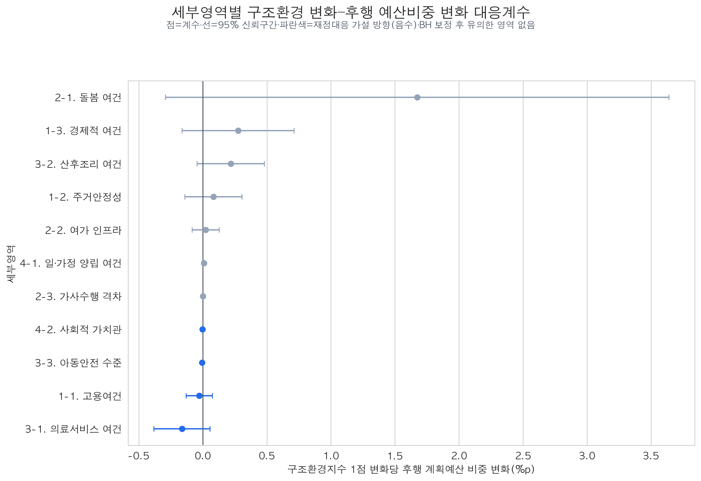
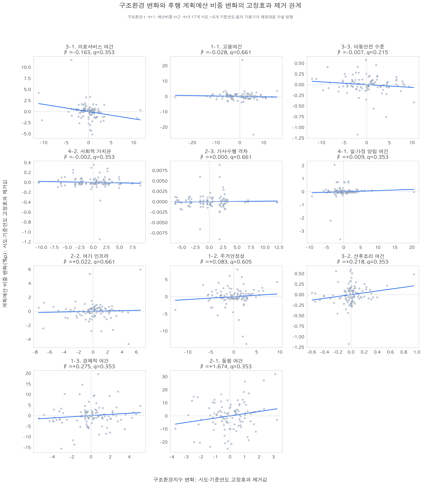
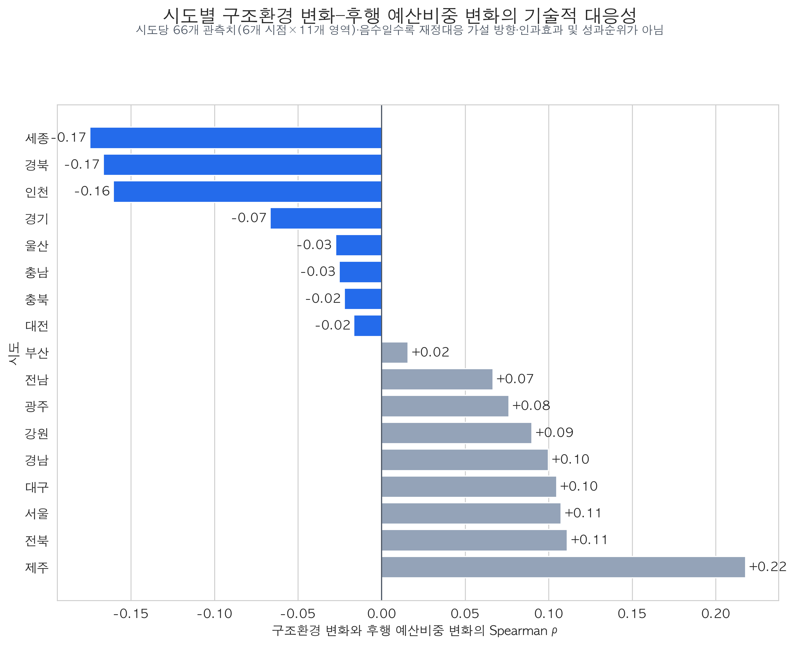
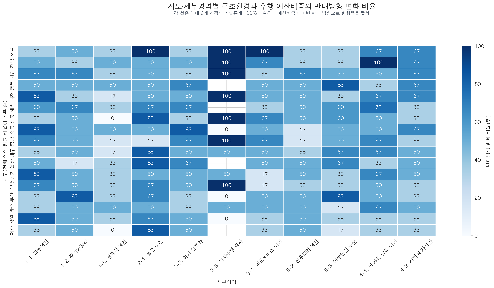

# 구조환경 변화와 후행 예산비중 변화의 대응성 분석

## 1. 핵심 결과

- `t→t+1`의 구조환경 변화와 `t+2→t+3`의 같은 영역 계획예산 비중 변화를 연결한 결과, **11개 세부영역 모두 BH 다중검정 보정 후 유의하지 않았다.**
- 재정대응 가설과 같은 음(-)의 계수는 의료서비스 여건, 고용여건, 아동안전 수준, 사회적 가치관에서 나타났다.
- 아동안전 수준은 보정 전 `p=0.0195`였지만 11개 영역을 함께 보정하면 `q=0.2148`로 남지 않았다.
- 따라서 구조환경이 악화된 영역의 예산비중이 이후 일관되게 확대됐다는 근거는 확인하지 못했다.
- 시도별 기술상관은 `-0.17~+0.22`로 전반적으로 약했다. 세종·경북·인천은 상대적으로 음의 방향이었지만 인과효과나 정책 성과순위로 해석하지 않는다.

## 2. 분석 질문과 시간 배열

기존 수준 기반 재정반응성 분석은 `구조환경지수(t) → 실질 1인당 예산(t+2)`를 분석했다. 본 분석은 수준이 아니라 변화에 대한 후행 배분 조정을 묻는다.

> 구조환경이 `t→t+1`에 악화되거나 개선된 뒤, 같은 영역의 계획예산 비중이 `t+2→t+3`에 반대 방향으로 조정되었는가?

| 기준연도(t) | 구조환경 변화 | 예산비중 변화 |
|---:|---|---|
| 2016 | 2016→2017 | 2018→2019 |
| 2017 | 2017→2018 | 2019→2020 |
| 2018 | 2018→2019 | 2020→2021 |
| 2019 | 2019→2020 | 2021→2022 |
| 2020 | 2020→2021 | 2022→2023 |
| 2021 | 2021→2022 | 2023→2024 |

표본은 `17개 시도 × 6개 기준연도 × 11개 세부영역 = 1,122행`이다. 구조환경지수는 높을수록 양호하므로, 환경이 나빠질 때 예산비중이 증가하는 재정대응 가설은 **음의 계수**로 나타난다.

## 3. 변수와 모형

### 3.1 구조환경 변화

```text
ΔStructure(i,k,t) = Structure(i,k,t+1) - Structure(i,k,t)
```

### 3.2 후행 계획예산 비중 변화

계획예산 비중은 지역×연도 전체 저출생 대응 계획예산(`지표체계 외` 포함)을 분모로 하고, 해당 세부영역 예산을 분자로 산출했다.

```text
ΔBudgetShare(i,k,t+2)
  = BudgetShare(i,k,t+3) - BudgetShare(i,k,t+2)
```

### 3.3 영역별 고정효과 모형

```text
ΔBudgetShare(i,k,t+2)
  = β(k) × ΔStructure(i,k,t)
  + 시도 고정효과(i)
  + 기준연도 고정효과(t)
  + 오차(i,k,t)
```

- 세부영역별로 모형을 각각 추정했다.
- 표준오차는 시도 단위로 군집화했다.
- 11개 영역의 p값은 Benjamini–Hochberg 방식으로 보정했다.
- 예측모형이 아니므로 데이터 분할과 CV는 적용하지 않았다.

## 4. 영역별 결과



| 방향 | 세부영역 | 계수 | p값 | BH q값 |
|---|---|---:|---:|---:|
| 가설 방향(-) | 의료서비스 여건 | -0.1627 | 0.1350 | 0.3531 |
| 가설 방향(-) | 고용여건 | -0.0275 | 0.5778 | 0.6613 |
| 가설 방향(-) | 아동안전 수준 | -0.0065 | 0.0195 | 0.2148 |
| 가설 방향(-) | 사회적 가치관 | -0.0020 | 0.2247 | 0.3531 |
| 반대 방향(+) | 돌봄 여건 | +1.6741 | 0.0899 | 0.3531 |
| 반대 방향(+) | 경제적 여건 | +0.2751 | 0.2003 | 0.3531 |
| 반대 방향(+) | 산후조리 여건 | +0.2185 | 0.0969 | 0.3531 |

나머지 영역도 계수와 신뢰구간은 산출했으나 모두 BH 보정 후 유의하지 않았다. 계수 크기만으로 정책 반응성을 줄 세우지 않는다. 특히 영역별 예산비중의 변동폭이 크게 달라 큰 계수가 곧 강한 정책효과를 뜻하지 않는다.



산점도는 시도 및 기준연도 평균을 제거한 변화량을 표시한다. 의료서비스·고용·아동안전·사회적 가치관은 음의 기울기지만, 신뢰구간과 다중검정을 고려하면 영역 전반의 일관된 반응이라고 판단할 수 없다.

## 5. 시도별 탐색 결과



- 시도별 Spearman 상관은 시도당 66개 관측치(6개 시점×11개 영역)를 합쳐 계산했다.
- 가장 음의 방향은 세종 `-0.17`, 경북 `-0.17`, 인천 `-0.16`이었다.
- 가장 양의 방향은 제주 `+0.22`였다.
- 상관의 절댓값이 모두 작고 영역별 단위와 변동성이 섞여 있으므로, 이 값은 지역별 정책 성과가 아니라 탐색적 기술통계다.



히트맵은 각 시도·영역에서 구조환경과 후행 예산비중이 반대 방향으로 움직인 시점의 비율이다. 셀당 최대 관측치가 6개에 불과하므로 100%도 안정적인 정책반응의 증거가 아니다. 빈 셀은 구조환경 또는 예산비중 변화가 0이어서 방향을 판정할 수 있는 관측치가 없음을 뜻한다.

## 6. 해석상 한계

1. 계획예산은 실제 집행액이 아니다.
2. 사업명과 사업의 통합·분리·기록 방식 변화가 예산비중 변화에 포함될 수 있다.
3. 예산비중은 합계가 제한된 구성자료라서 한 영역의 증가는 다른 영역의 비중 감소를 기계적으로 유발한다.
4. 1,122행 중 92행은 두 예산연도 중 적어도 하나에 예산누락주의 표시가 있다.
5. 구조환경 변화가 예산편성자에게 실제로 관측된 시점과 지표 공표 시점이 완전히 일치한다고 보장할 수 없다.
6. 본 결과는 후행 변화의 조건부 관련성이며 인과효과나 역인과성의 확정적 검정이 아니다.

## 7. 재현 경로

- 입력 구조환경: `data/processed/structural_index/structural_index_pooled_subcategory_scores.csv`
- 입력 예산비중: `data/processed/analysis/2016-2024_지역연도_세부영역별_계획예산비중.csv`
- 표본 생성: `scripts/build_structural_budget_share_change_sample.py`
- 모형 실행: `scripts/run_structural_budget_share_change_response.py`
- 시각화 생성: `scripts/build_structural_budget_share_change_visualizations.py`
- 테스트: `tests/test_structural_budget_share_change_response.py`

```bash
uv run python scripts/build_structural_budget_share_change_sample.py
uv run python scripts/run_structural_budget_share_change_response.py
uv run python scripts/build_structural_budget_share_change_visualizations.py
uv run pytest -q tests/test_structural_budget_share_change_response.py
```
