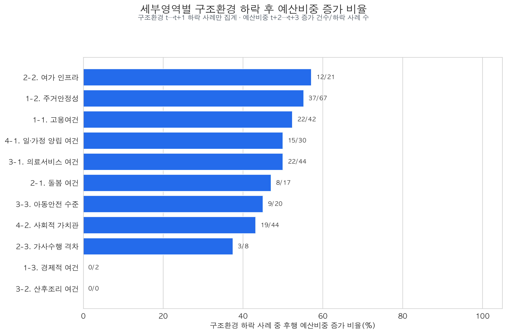
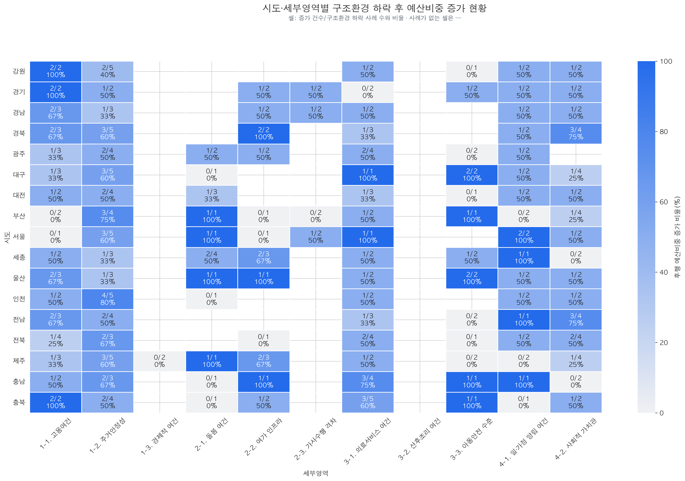

# 구조환경 하락 사례의 후행 예산비중 증가 현황

## 무엇을 보는 자료인가

기존 변화량 회귀분석(#108)의 표본에서 구조환경지수가 `t→t+1`에 실제로 하락한 사례만 선별했다. 이후 같은 세부영역의 계획예산 비중이 `t+2→t+3`에 증가했으면 팀이 정의한 **대응 방향 일치**로 표시했다.

```text
구조환경지수 변화 < 0  AND  후행 예산비중 변화 > 0
```

이 자료는 “환경이 나빠진 뒤 예산배분 비중을 늘렸는가”를 사건 수로 보여주는 기술통계다. 회귀계수, 인과효과 또는 정책성과 점수가 아니다.

## 전체 결과

- 구조환경 하락 사례: 295건
- 이후 같은 영역의 예산비중 증가: 147건
- 전체 대응 방향 일치율: 49.8%

즉 구조환경이 하락한 사례의 약 절반에서 이후 같은 영역의 예산비중이 증가했다. 반대로 약 절반에서는 증가하지 않았다. 따라서 전체적으로 일관된 대응 패턴이라고 보기는 어렵다는 기존 #108 회귀결과와 방향이 같다.

## 세부영역별 결과



- 여가 인프라: 12/21건, 57.1%
- 주거안정성: 37/67건, 55.2%
- 고용여건: 22/42건, 52.4%
- 의료서비스 여건: 22/44건, 50.0%
- 일·가정 양립 여건: 15/30건, 50.0%
- 돌봄 여건: 8/17건, 47.1%
- 아동안전 수준: 9/20건, 45.0%
- 사회적 가치관: 19/44건, 43.2%
- 가사수행 격차: 3/8건, 37.5%
- 경제적 여건: 0/2건 — 사례가 너무 적어 비교에 부적합
- 산후조리 여건: 하락 사례 0건 — 비율 산출 불가

예산누락주의 사례를 제외해도 주요 비율은 대체로 비슷했다. 다만 돌봄은 47.1%에서 53.3%, 사회적 가치관은 43.2%에서 37.5%로 달라져 원자료 기록 문제의 영향을 함께 확인해야 한다.

## 시도×세부영역 결과



각 셀은 `예산비중 증가 건수/구조환경 하락 사례 수`와 비율을 함께 표시한다. 예를 들어 `1/1, 100%`는 한 번의 하락 사례에서 한 번 증가했다는 의미일 뿐, 안정적으로 잘 대응했다는 뜻은 아니다. `—`는 해당 시도·영역에서 구조환경 하락 사례가 없었다는 뜻이다.

## 해석할 때 지켜야 할 기준

1. “잘 반응했다”는 표현은 **대응 방향이 일치했다**는 기술적 의미로만 사용한다.
2. 분모가 1~2건인 100%와 분모가 4~5건인 비율을 동일하게 평가하지 않는다.
3. 예산비중은 합계가 제한된 구성자료이므로 다른 영역 비중이 커지면 해당 영역 비중이 줄 수 있다.
4. 계획예산은 집행액이 아니고 사업 통합·분리·기록 변화가 증감에 포함될 수 있다.
5. 구조환경 하락과 후행 예산비중 증가가 함께 나타났다는 사실만으로 환경 악화가 예산 증가를 유발했다고 볼 수 없다.

## 재현 경로

- 입력: `data/processed/analysis/2016-2024_구조환경변화_후행예산비중변화_표본.csv`
- 사례표: `data/processed/analysis/2016-2024_구조환경하락_후행예산비중증가_사례.csv`
- 영역 요약: `data/processed/analysis/2016-2024_세부영역별_구조환경하락_후행예산비중증가_요약.csv`
- 시도×영역 요약: `data/processed/analysis/2016-2024_시도세부영역별_구조환경하락_후행예산비중증가_요약.csv`
- 실행: `uv run python scripts/build_structural_decline_budget_share_response_visualizations.py`
- 테스트: `uv run pytest -q tests/test_build_structural_decline_budget_share_response_visualizations.py`
