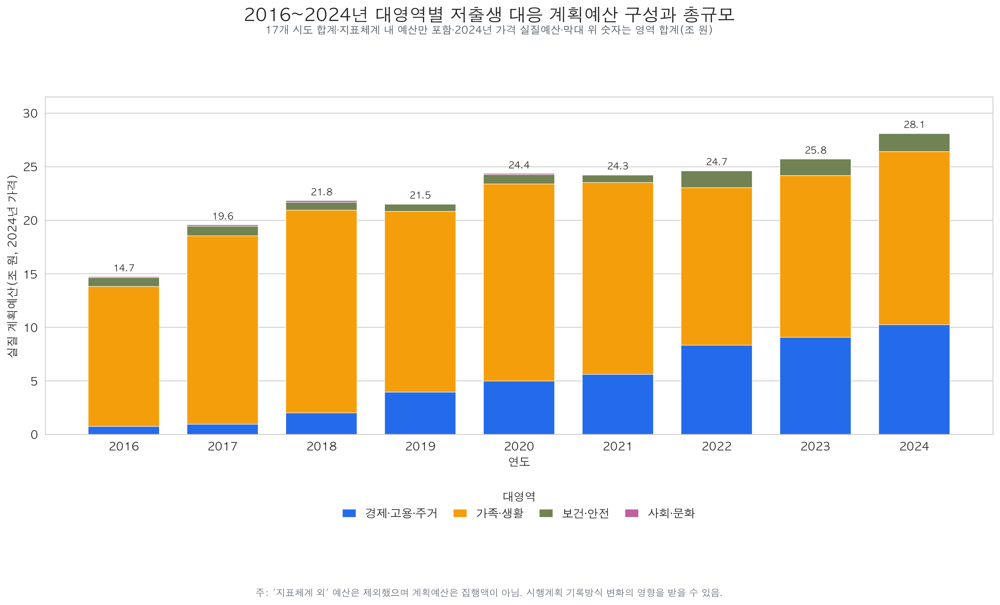
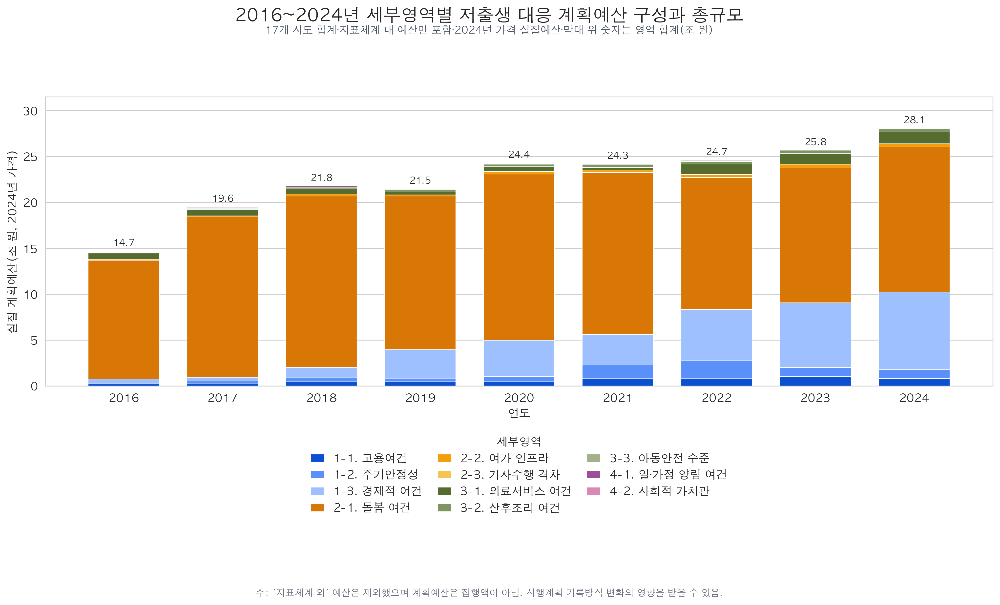
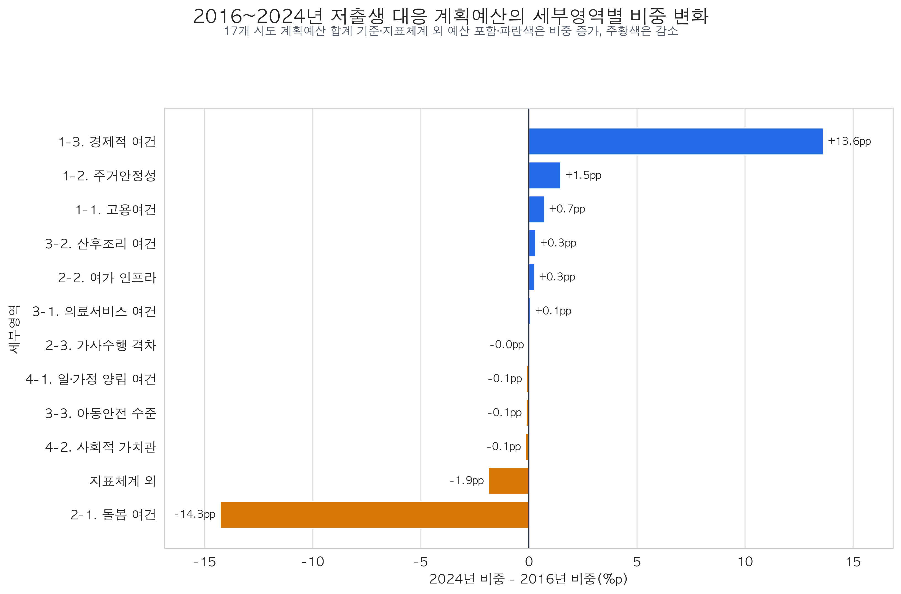
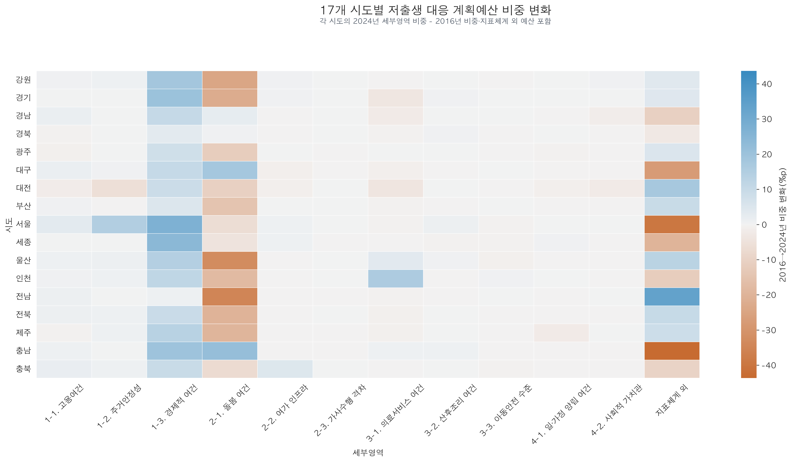
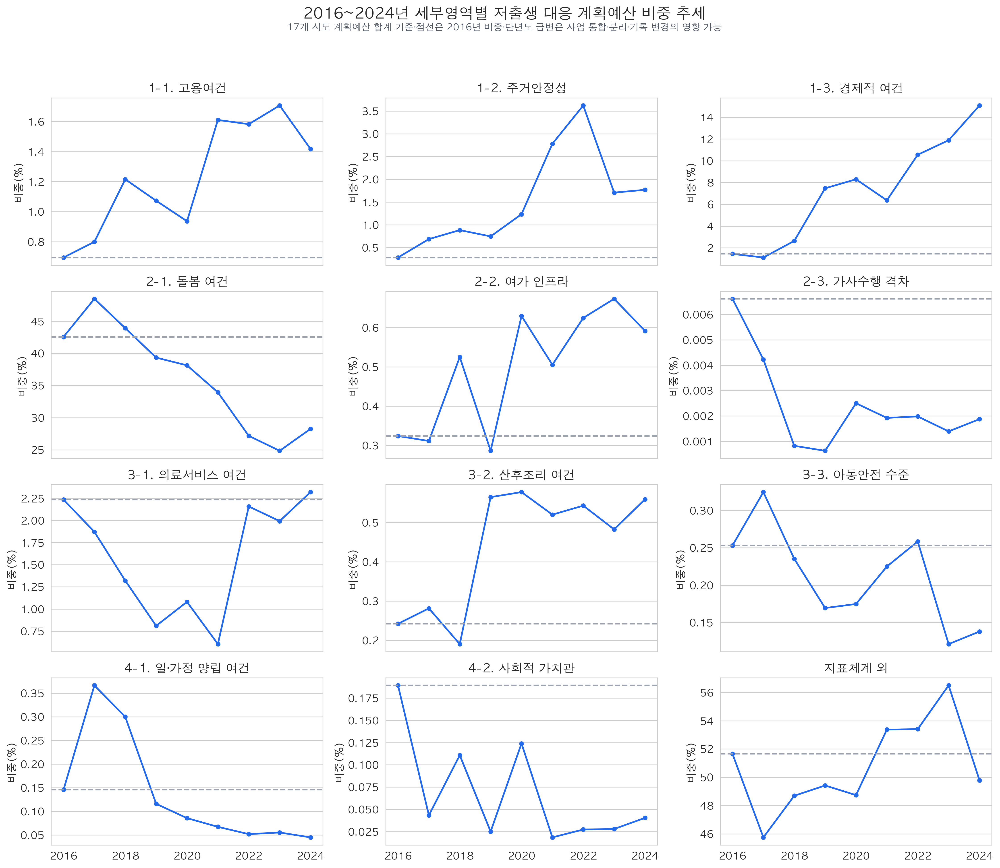

# 저출생 대응 계획예산 비중 변화

## 기술 요약

- 지역·연도별 전체 저출생 대응 계획예산을 분모로 하고 11개 세부영역과 `지표체계 외`의 구성비를 계산했다.
- 전국 시도 합계 기준으로 2016→2024년 가장 큰 증가는 경제적 여건 `+13.6%p`, 가장 큰 감소는 돌봄 여건 `-14.3%p`였다.
- 단년도 비교의 민감도를 확인하기 위해 2016~2018년과 2022~2024년의 예산 합계 기준 비중도 함께 비교했다. 이 기준에서도 경제적 여건은 `+10.8%p`, 돌봄 여건은 `-18.3%p`로 큰 변화가 유지됐다.
- `지표체계 외`은 2016→2024년 단년도 비교에서 `-1.9%p`였지만, 3개년 구간 비교에서는 `+4.7%p`였다. 이는 시작·종료 연도 선택에 따라 해석이 달라질 수 있음을 보여준다.

## 세부영역별 변화표

| 세부영역 | 2016 비중 | 2024 비중 | 2016→2024 변화 | 2016~2018 비중 | 2022~2024 비중 | 3개년 구간 변화 |
|---|---:|---:|---:|---:|---:|---:|
| 1-1. 고용여건 | 0.69% | 1.42% | +0.72%p | 0.94% | 1.57% | +0.64%p |
| 1-2. 주거안정성 | 0.28% | 1.77% | +1.49%p | 0.65% | 2.31% | +1.66%p |
| 1-3. 경제적 여건 | 1.44% | 15.08% | +13.64%p | 1.80% | 12.57% | +10.77%p |
| 2-1. 돌봄 여건 | 42.54% | 28.25% | -14.28%p | 45.03% | 26.72% | -18.31%p |
| 2-2. 여가 인프라 | 0.32% | 0.59% | +0.27%p | 0.40% | 0.63% | +0.23%p |
| 2-3. 가사수행 격차 | 0.01% | 0.00% | -0.01%p | 0.00% | 0.00% | -0.00%p |
| 3-1. 의료서비스 여건 | 2.24% | 2.32% | +0.09%p | 1.75% | 2.16% | +0.40%p |
| 3-2. 산후조리 여건 | 0.24% | 0.56% | +0.32%p | 0.23% | 0.53% | +0.29%p |
| 3-3. 아동안전 수준 | 0.25% | 0.14% | -0.11%p | 0.27% | 0.17% | -0.10%p |
| 4-1. 일·가정 양립 여건 | 0.15% | 0.05% | -0.10%p | 0.28% | 0.05% | -0.23%p |
| 4-2. 사회적 가치관 | 0.19% | 0.04% | -0.15%p | 0.11% | 0.03% | -0.08%p |
| 지표체계 외 | 51.65% | 49.79% | -1.87%p | 48.53% | 53.26% | +4.73%p |

## 시각화

막대 전체 높이는 `지표체계 외`을 제외한 11개 세부영역의 2024년 가격 실질 계획예산 합계이고, 색상별 구간은 대영역별 예산액이다. 따라서 막대 위 총액은 전체 저출생 대응 계획예산이 아니라 현재 지표체계에 연결된 예산의 합계이다.

세부영역 버전은 동일한 지표체계 내 예산 합계를 11개 세부영역으로 다시 나눈 그림이다. `지표체계 외`은 두 그래프에서 모두 제외했으며, 연도별 총액은 동일하고 구성 분류 수준만 다르다.

## 산출 방법과 한계

- 비중은 `해당 지역·연도의 세부영역 계획예산 ÷ 전체 저출생 대응 계획예산 × 100`으로 산출했다.
- `지표체계 외`도 저출생 대응 사업의 일부이므로 분모와 구성영역에 모두 포함했다.
- 동일한 지역·연도 내에서 산출하는 구성비이므로 명목예산과 CPI 실질화 예산으로 계산한 비중은 같다.
- 전국 요약은 17개 시도 예산을 먼저 합산한 뒤 구성비를 계산했으므로 예산 규모가 큰 시도의 영향을 더 많이 받는다. 시도별 비중 변화는 별도 표와 히트맵으로 제시했다.
- 시행계획의 사업명·사업범위·예산 기록이 연도별로 통합·분리·누락될 수 있다. 따라서 비중 변화는 순수한 정책 우선순위 변화뿐 아니라 기록방식 변화의 영향을 포함할 수 있다.
- `예산결측_사업수 > 0`인 지역·연도·세부영역은 원자료 누락 가능성을 확인할 수 있도록 산출표에 `예산누락주의`로 표시했다.

## 재현성 메타데이터

- 분석기간·규모: 2016~2024년, 17개 시도
- 입력 데이터: `data/processed/analysis/2016-2024_세부영역별_인구1인당_실질예산액.csv`
- 입력 파일 SHA-256: `734fd55c4ae5a8dc1a466fee156557315c570151a4fa449114e7d66feb08d759`
- 산출 기준일: 2026-08-08
- 데이터 분할 전략: 해당 없음. 예측모형이 아니라 전체 패널의 예산 구성과 비중 변화를 기술하는 분석이다.
- 평가 지표: 해당 없음. 예측성능 평가 대신 예산 합계, 구성비, 비중 변화(%p)를 산출한다.
- CV fold 수: 해당 없음. 모형 학습 및 교차검증을 수행하지 않는다.

## 산출물

- `data/processed/analysis/2016-2024_지역연도_세부영역별_계획예산비중.csv`
- `data/processed/analysis/2016-2024_세부영역별_계획예산비중_변화요약.csv`
- `data/processed/analysis/2016-2024_시도별_세부영역_계획예산비중_변화.csv`
- `data/processed/analysis/2016-2024_연도별_대영역별_저출생대응_실질계획예산_구성.csv`
- `data/processed/analysis/2016-2024_연도별_세부영역별_저출생대응_실질계획예산_구성.csv`
